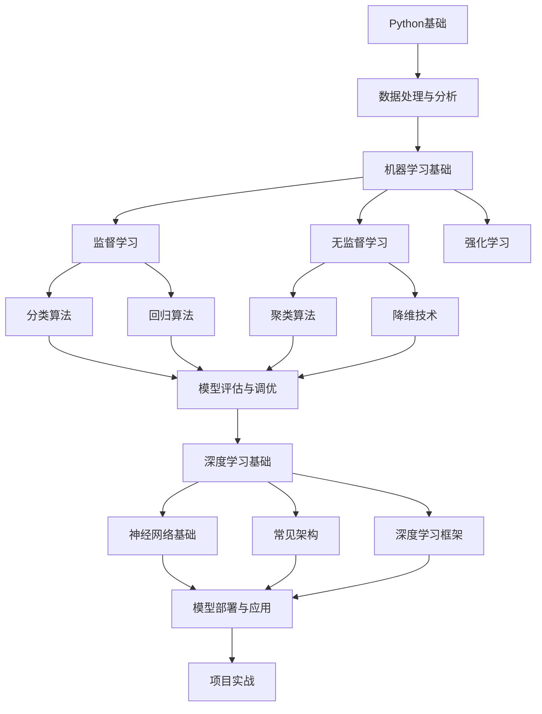

# AI学习指南

## 学习路线图



## 专业名词解释

## 1. 机器学习
机器学习 ：是人工智能的一个分支，通过算法让计算机从数据中学习规律，从而能够对新数据做出预测或决策，而不需要明确的编程指令。

生活例子 ：就像教孩子识别动物，你不需要告诉孩子每个动物的具体特征，而是通过展示多张动物图片，让孩子自己学习识别规律。

## 2. 监督学习
监督学习 ：一种机器学习方法，使用带有标签的数据集进行训练，模型学习输入和输出之间的映射关系，用于预测或分类任务。

生活例子 ：就像学习外语时，有老师告诉你每个单词的正确翻译，你通过这些例子学习单词和翻译之间的对应关系。

## 3. 无监督学习
无监督学习 ：一种机器学习方法，使用没有标签的数据集进行训练，模型自动发现数据中的模式和结构，用于聚类、降维等任务。

生活例子 ：就像整理书架，你不需要有人告诉你每本书属于哪个类别，而是通过观察书的封面、标题等特征，自动将相似的书放在一起。

## 4. 特征
特征 ：数据中用于描述样本的属性或变量，是模型学习的输入。

生活例子 ：在预测房价时，房屋的面积、卧室数量、地理位置等都是特征。

## 5. 目标值
目标值 ：模型需要预测的输出值，在监督学习中，每个样本都有对应的目标值。

生活例子 ：在预测房价时，实际的房价就是目标值。

## 6. 过拟合
过拟合 ：模型在训练数据上表现很好，但在未见过的测试数据上表现很差的现象，通常是因为模型过于复杂，学习了训练数据中的噪声。

生活例子 ：就像学生死记硬背考试题目，在模拟考试中成绩很好，但在真正的考试中遇到新题目就不会做了。

## 7. 模型参数
模型参数 ：模型中可以通过训练学习的变量，如线性回归中的斜率和截距。

生活例子 ：就像食谱中的 ingredients 比例，通过多次尝试调整，找到最佳比例。

## 8. 超参数
超参数 ：模型训练前需要设置的参数，如K均值聚类中的K值，决策树的最大深度等。

生活例子 ：就像烹饪时的火候大小，需要在开始烹饪前设置好。

## 9. 聚类
聚类 ：将相似的数据点分组到同一簇中，不同簇的数据点差异较大的过程。

生活例子 ：就像整理衣柜，将相似的衣服放在一起，如将所有T恤放在一个抽屉，所有裤子放在另一个抽屉。

## 10. 簇
簇 ：聚类算法将数据点分组后形成的一个组，同一簇中的数据点具有相似的特征。

生活例子 ：就像衣柜中的一个抽屉，里面放的都是同一类型的衣服。

## 11. 降维
降维 ：在保留数据关键信息的同时，减少数据维度的过程，用于解决高维数据的问题。

生活例子 ：就像将一本厚书总结成几页的摘要，保留重要信息的同时减少了内容量。

## 12. 神经网络
神经网络 ：一种模仿人脑神经元结构的机器学习模型，由输入层、隐藏层和输出层组成。

生活例子 ：就像一个团队，输入层接收信息，隐藏层的成员处理信息，输出层给出最终结果。

## 13. 激活函数
激活函数 ：神经网络中用于引入非线性的函数，如ReLU、sigmoid、tanh等。

生活例子 ：就像一个开关，当输入信号达到一定强度时，神经元被激活并传递信号。

## 14. 反向传播
反向传播 ：训练神经网络的算法，通过计算损失函数对各参数的梯度，从输出层向输入层反向传播，更新模型参数。

生活例子 ：就像老师批改作业，从最后结果开始，逐步检查每一步的错误，然后告诉学生如何改进。

## 15. 卷积神经网络
卷积神经网络 ：一种特殊的神经网络，适用于处理图像等网格结构数据，使用卷积层提取特征。

生活例子 ：就像识别人脸，先识别眼睛、鼻子、嘴巴等局部特征，然后将这些特征组合起来识别整个人脸。

## 16. 循环神经网络
循环神经网络 ：一种适用于处理序列数据的神经网络，能够捕捉序列中的依赖关系。

生活例子 ：就像理解一句话的意思，需要考虑单词之间的顺序和上下文关系。

## 17. 模型部署
模型部署 ：将训练好的模型集成到实际应用中的过程，使其能够处理新的数据并做出预测。

生活例子 ：就像将实验室开发的新药投入市场，让更多人受益。

## 18. 特征工程
特征工程 ：从原始数据中提取、转换和选择特征的过程，目的是提高模型的性能。

生活例子 ：就像准备食材，将原材料清洗、切割、调味，使其更适合烹饪。

## 19. 数据预处理
数据预处理 ：对原始数据进行清洗、转换和标准化的过程，使其适合模型训练。

生活例子 ：就像洗衣服，先将脏衣服分类、浸泡、清洗，使其干净整洁。

## 20. 交叉验证
交叉验证 ：一种模型评估方法，将数据集分为多个子集，轮流使用不同的子集作为验证集，评估模型的泛化能力。

生活例子 ：就像学生做模拟考试，用不同的试卷测试自己的知识掌握程度，确保在真正的考试中能取得好成绩。

## 额外补充的专业名词
### 21. 损失函数
损失函数 ：衡量模型预测值与真实值之间差异的函数，用于指导模型参数的更新。

生活例子 ：就像老师给学生打分，分数越低说明学生的答案与正确答案的差距越大。

### 22. 优化器
优化器 ：用于最小化损失函数的算法，如SGD、Adam等。

生活例子 ：就像导航软件，帮助你找到从当前位置到目的地的最佳路线。

### 23. 批量大小
批量大小 ：模型训练时每次处理的数据样本数量。

生活例子 ：就像工厂生产，每次处理一批产品，而不是一个一个处理。

### 24. 轮次
轮次 ：模型训练时完整遍历数据集的次数。

生活例子 ：就像学生复习，完整看一遍课本就是一个轮次。

### 25. 验证集
验证集 ：用于在训练过程中评估模型性能的数据集，用于调整超参数。

生活例子 ：就像模拟考试，用于评估学生的学习情况，但不用于最终评分。

### 26. 测试集
测试集 ：用于在模型训练完成后评估模型最终性能的数据集。

生活例子 ：就像期末考试，用于最终评估学生的学习成果。

### 27. 泛化能力
泛化能力 ：模型对未见过的数据的预测能力。

生活例子 ：就像学生不仅能解决做过的题目，还能解决新的类似题目。

### 28. 梯度下降
梯度下降 ：一种优化算法，通过沿着损失函数的负梯度方向更新参数，以最小化损失函数。

生活例子 ：就像下山，总是朝着最陡峭的方向走，以最快速度到达山脚。

### 29. 正则化
正则化 ：一种防止过拟合的技术，通过在损失函数中添加惩罚项，限制模型参数的大小。

生活例子 ：就像老师要求学生的答案简洁明了，避免冗长的解释。

### 30. 集成学习
集成学习 ：通过组合多个模型的预测结果，提高整体性能的方法，如随机森林、梯度提升树等。

生活例子 ：就像团队合作，多个专家一起讨论，做出比单个专家更好的决策。

## 已学习的知识

### 1. 线性回归基础

#### 步骤1：场景引入（提出问题）
如何预测房价？如何根据学习时间预测考试成绩？线性回归可以帮助我们建立这些变量之间的关系模型。

#### 步骤2：前置知识确认
学习线性回归需要了解：
- Python基础语法
- NumPy库的基本使用
- 简单的数学知识（直线方程）

#### 步骤3：完整代码展示
```python
# 导入必要的库
import numpy as np  # 用于数值计算
import matplotlib.pyplot as plt  # 用于数据可视化
from sklearn.linear_model import LinearRegression  # 线性回归模型
from sklearn.model_selection import train_test_split  # 用于划分数据集
from sklearn.metrics import mean_squared_error, r2_score  # 用于模型评估

# 生成模拟数据
np.random.seed(42)  # 设置随机种子，确保结果可重复
X = 2 * np.random.rand(100, 1)  # 生成100个0-2之间的随机数作为特征
y = 4 + 3 * X + np.random.randn(100, 1)  # 生成对应的目标值，添加一些噪声

# 数据可视化
plt.scatter(X, y)  # 绘制散点图
plt.xlabel('特征 (X)')  # 设置x轴标签
plt.ylabel('目标值 (y)')  # 设置y轴标签
plt.title('模拟数据集')  # 设置图表标题
plt.show()  # 显示图表

# 划分训练集和测试集
# test_size=0.2 表示测试集占总数据的20%
# random_state=42 确保每次划分结果相同
X_train, X_test, y_train, y_test = train_test_split(X, y, test_size=0.2, random_state=42)

# 创建并训练线性回归模型
model = LinearRegression()  # 创建线性回归模型实例
model.fit(X_train, y_train)  # 使用训练数据训练模型

# 查看模型参数
print("模型系数 (θ1):", model.coef_[0][0])  # 打印斜率
print("截距 (θ0):", model.intercept_[0])  # 打印截距

# 在测试集上进行预测
y_pred = model.predict(X_test)  # 使用训练好的模型预测测试集

# 模型评估
mse = mean_squared_error(y_test, y_pred)  # 计算均方误差
r2 = r2_score(y_test, y_pred)  # 计算R²评分
print("均方误差 (MSE):", mse)  # 打印均方误差
print("R² 评分:", r2)  # 打印R²评分

# 可视化模型预测结果
plt.scatter(X_test, y_test, color='blue', label='真实值')  # 绘制测试集真实值
plt.plot(X_test, y_pred, color='red', linewidth=2, label='预测值')  # 绘制预测值
plt.xlabel('特征 (X)')  # 设置x轴标签
plt.ylabel('目标值 (y)')  # 设置y轴标签
plt.title('线性回归模型预测结果')  # 设置图表标题
plt.legend()  # 显示图例
plt.show()  # 显示图表
```

#### 步骤4：逐行/逐模块代码详解
1. **导入库**：导入NumPy用于数值计算，Matplotlib用于可视化，以及scikit-learn中的线性回归相关模块。
2. **生成模拟数据**：使用NumPy生成100个随机特征值，并根据线性关系生成目标值，添加一些噪声使数据更真实。
3. **数据可视化**：使用Matplotlib绘制散点图，直观查看数据分布。
4. **划分数据集**：将数据分为训练集（80%）和测试集（20%）。
5. **创建并训练模型**：初始化线性回归模型并使用训练数据进行训练。
6. **查看模型参数**：打印出学习到的斜率和截距。
7. **模型预测**：使用训练好的模型对测试集进行预测。
8. **模型评估**：计算均方误差（MSE）和R²评分来评估模型性能。
9. **结果可视化**：绘制测试集的真实值和预测值，直观对比模型表现。

#### 步骤5：代码执行过程模拟
1. 生成100个随机特征值X和对应的目标值y。
2. 绘制X和y的散点图，观察数据分布。
3. 将数据随机分为训练集和测试集。
4. 模型通过训练集学习X和y之间的线性关系，计算出最佳的斜率和截距。
5. 使用学习到的模型对测试集进行预测，得到预测值y_pred。
6. 计算预测值与真实值之间的误差，评估模型性能。
7. 绘制真实值和预测值的对比图，展示模型预测效果。

#### 步骤6：完整运行结果展示
```text
模型系数 (θ1): 2.7701133850901193
截距 (θ0): 4.215096157546746
均方误差 (MSE): 0.9177523137653968
R² 评分: 0.7648031426311838
```

**可视化结果**：
- 第一张图：显示了生成的模拟数据点分布
- 第二张图：显示了测试集的真实值（蓝色点）和模型预测值（红色直线）

#### 步骤7：避坑提示与知识点关联
**避坑提示**：
- **数据标准化**：如果特征值范围差异很大，建议先对数据进行标准化处理。
- **过拟合风险**：线性回归虽然简单，但也可能过拟合，特别是当特征数量很多时。
- **异常值影响**：线性回归对异常值比较敏感，需要先处理异常值。

**知识点关联**：
- 线性回归是**监督学习**的基础算法
- 它是许多复杂模型的基础，如神经网络中的线性层
- 与**多项式回归**、**岭回归**等算法相关

#### 步骤8：动手练习与拓展
1. **练习1**：使用不同的随机种子生成数据，观察模型参数的变化。
2. **练习2**：调整测试集的比例（如30%），观察模型评估指标的变化。
3. **练习3**：尝试添加更多特征，实现多变量线性回归。
4. **拓展**：思考如何处理非线性关系的数据，了解多项式回归。

##### 练习答案

**练习1答案**：
```python
# 使用不同的随机种子生成数据
import numpy as np
import matplotlib.pyplot as plt
from sklearn.linear_model import LinearRegression
from sklearn.model_selection import train_test_split

# 使用随机种子10
np.random.seed(10)
X1 = 2 * np.random.rand(100, 1)
y1 = 4 + 3 * X1 + np.random.randn(100, 1)

# 使用随机种子20
np.random.seed(20)
X2 = 2 * np.random.rand(100, 1)
y2 = 4 + 3 * X2 + np.random.randn(100, 1)

# 训练模型
model1 = LinearRegression()
model1.fit(X1, y1)

model2 = LinearRegression()
model2.fit(X2, y2)

# 打印模型参数
print("随机种子10 - 系数:", model1.coef_[0][0], "截距:", model1.intercept_[0])
print("随机种子20 - 系数:", model2.coef_[0][0], "截距:", model2.intercept_[0])
```

**练习2答案**：
```python
import numpy as np
from sklearn.linear_model import LinearRegression
from sklearn.model_selection import train_test_split
from sklearn.metrics import mean_squared_error, r2_score

# 生成数据
np.random.seed(42)
X = 2 * np.random.rand(100, 1)
y = 4 + 3 * X + np.random.randn(100, 1)

# 使用30%测试集
X_train, X_test, y_train, y_test = train_test_split(X, y, test_size=0.3, random_state=42)

# 训练模型
model = LinearRegression()
model.fit(X_train, y_train)

# 预测和评估
y_pred = model.predict(X_test)
mse = mean_squared_error(y_test, y_pred)
r2 = r2_score(y_test, y_pred)

print("测试集比例30% - MSE:", mse, "R²:", r2)
```

**练习3答案**：
```python
import numpy as np
from sklearn.linear_model import LinearRegression
from sklearn.model_selection import train_test_split

# 生成多变量数据
np.random.seed(42)
X = np.random.rand(100, 2)  # 2个特征
y = 4 + 3 * X[:, 0:1] + 5 * X[:, 1:2] + np.random.randn(100, 1)

# 划分数据集
X_train, X_test, y_train, y_test = train_test_split(X, y, test_size=0.2, random_state=42)

# 训练模型
model = LinearRegression()
model.fit(X_train, y_train)

# 打印模型参数
print("系数:", model.coef_[0])
print("截距:", model.intercept_[0])

# 预测
y_pred = model.predict(X_test)
print("预测值示例:", y_pred[:5].flatten())
print("真实值示例:", y_test[:5].flatten())
```

**拓展答案**：
对于非线性关系的数据，可以使用多项式回归。多项式回归通过将特征的高次幂作为新特征，从而拟合非线性关系。

```python
import numpy as np
import matplotlib.pyplot as plt
from sklearn.preprocessing import PolynomialFeatures
from sklearn.linear_model import LinearRegression
from sklearn.pipeline import make_pipeline

# 生成非线性数据
np.random.seed(42)
X = np.linspace(-3, 3, 100).reshape(-1, 1)
y = 2 + X + 0.5 * X**2 + np.random.randn(100, 1)

# 创建多项式回归模型（2次多项式）
model = make_pipeline(PolynomialFeatures(degree=2), LinearRegression())
model.fit(X, y)

# 预测
X_new = np.linspace(-3, 3, 100).reshape(-1, 1)
y_pred = model.predict(X_new)

# 可视化
plt.scatter(X, y, label='原始数据')
plt.plot(X_new, y_pred, color='red', label='多项式回归')
plt.xlabel('X')
plt.ylabel('y')
plt.title('多项式回归拟合非线性数据')
plt.legend()
plt.show()
```

### 2. 数据集划分

#### 步骤1：场景引入（提出问题）
为什么我们需要将数据集划分为训练集和测试集？如何确保模型在新数据上也能表现良好？

#### 步骤2：前置知识确认
学习数据集划分需要了解：
- Python基础语法
- NumPy库的基本使用
- 机器学习的基本概念

#### 步骤3：完整代码展示
```python
from sklearn.model_selection import train_test_split  # 用于划分数据集
import numpy as np  # 用于数值计算

# 生成模拟数据
X = np.random.rand(100, 2)  # 100个样本，2个特征
y = np.random.rand(100, 1)  # 100个目标值

# 第一次划分：训练集和测试集
# test_size=0.2 表示测试集占总数据的20%
# random_state=42 确保每次划分结果相同
X_train, X_test, y_train, y_test = train_test_split(
    X, y, test_size=0.2, random_state=42
)

# 第二次划分：从训练集中划分出验证集
# test_size=0.25 表示验证集占训练集的25%，即总数据的20%
X_train, X_val, y_train, y_val = train_test_split(
    X_train, y_train, test_size=0.25, random_state=42  # 0.25 * 0.8 = 0.2
)

# 打印各数据集的大小
print("训练集大小:", X_train.shape)  # 打印训练集大小
print("验证集大小:", X_val.shape)  # 打印验证集大小
print("测试集大小:", X_test.shape)  # 打印测试集大小
```

#### 步骤4：逐行/逐模块代码详解
1. **导入库**：导入train_test_split函数用于数据集划分，导入NumPy用于生成模拟数据。
2. **生成模拟数据**：使用NumPy生成100个样本，每个样本有2个特征和1个目标值。
3. **第一次划分**：将数据分为训练集（80%）和测试集（20%）。
4. **第二次划分**：从训练集中划分出验证集（占总数据的20%）。
5. **打印数据集大小**：输出各数据集的形状，确认划分结果。

#### 步骤5：代码执行过程模拟
1. 生成100个样本的模拟数据。
2. 第一次划分：将数据随机分为训练集（80个样本）和测试集（20个样本）。
3. 第二次划分：将训练集（80个样本）进一步分为新的训练集（60个样本）和验证集（20个样本）。
4. 打印各数据集的大小，验证划分是否正确。

#### 步骤6：完整运行结果展示
```text
训练集大小: (60, 2)
验证集大小: (20, 2)
测试集大小: (20, 2)
```

#### 步骤7：避坑提示与知识点关联
**避坑提示**：
- **随机种子**：设置random_state确保每次划分结果相同，便于复现实验。
- **数据泄露**：验证集和测试集不能用于模型训练，否则会导致过拟合。
- **类别分布**：对于分类问题，应使用stratify参数保持类别分布一致。

**知识点关联**：
- 数据集划分是**模型评估**的重要步骤
- 与**交叉验证**、**超参数调优**等概念相关
- 是机器学习工作流程中的标准步骤

#### 步骤8：动手练习与拓展
1. **练习1**：尝试使用不同的测试集比例，观察对模型评估的影响。
2. **练习2**：对于分类问题，使用stratify参数保持类别分布一致。
3. **拓展**：了解k折交叉验证的实现方法。

### 3. AI模型训练

#### 步骤1：场景引入（提出问题）
如何训练一个AI模型？从数据准备到模型评估的完整流程是怎样的？

#### 步骤2：前置知识确认
学习AI模型训练需要了解：
- Python基础语法
- NumPy和Matplotlib库的使用
- 机器学习的基本概念
- 数据集划分的方法

#### 步骤3：完整代码展示
```python
# 导入必要的库
import numpy as np  # 用于数值计算
import matplotlib.pyplot as plt  # 用于数据可视化
from sklearn.datasets import load_iris  # 加载鸢尾花数据集
from sklearn.model_selection import train_test_split  # 用于划分数据集
from sklearn.linear_model import LogisticRegression  # 逻辑回归模型
from sklearn.metrics import accuracy_score, confusion_matrix  # 用于模型评估

# 加载数据集
iris = load_iris()  # 加载鸢尾花数据集
X = iris.data  # 特征数据
y = iris.target  # 目标值（类别标签）

# 划分训练集和测试集
# test_size=0.2 表示测试集占总数据的20%
# random_state=42 确保每次划分结果相同
X_train, X_test, y_train, y_test = train_test_split(
    X, y, test_size=0.2, random_state=42
)

# 创建并训练模型
model = LogisticRegression()  # 创建逻辑回归模型实例
model.fit(X_train, y_train)  # 使用训练数据训练模型

# 在测试集上进行预测
y_pred = model.predict(X_test)  # 使用训练好的模型预测测试集

# 模型评估
accuracy = accuracy_score(y_test, y_pred)  # 计算准确率
conf_matrix = confusion_matrix(y_test, y_pred)  # 计算混淆矩阵

# 打印评估结果
print("准确率:", accuracy)  # 打印准确率
print("混淆矩阵:")  # 打印混淆矩阵
print(conf_matrix)

# 可视化预测结果
plt.figure(figsize=(10, 6))  # 设置图表大小
# 绘制散点图，颜色表示预测的类别
plt.scatter(X_test[:, 0], X_test[:, 1], c=y_pred, cmap='viridis', s=100)
plt.xlabel('花萼长度')  # 设置x轴标签
plt.ylabel('花萼宽度')  # 设置y轴标签
plt.title('鸢尾花分类预测结果')  # 设置图表标题
plt.show()  # 显示图表
```

#### 步骤4：逐行/逐模块代码详解
1. **导入库**：导入NumPy用于数值计算，Matplotlib用于可视化，以及scikit-learn中的相关模块。
2. **加载数据集**：加载鸢尾花数据集，获取特征数据和目标值。
3. **划分数据集**：将数据分为训练集（80%）和测试集（20%）。
4. **创建并训练模型**：初始化逻辑回归模型并使用训练数据进行训练。
5. **模型预测**：使用训练好的模型对测试集进行预测。
6. **模型评估**：计算准确率和混淆矩阵来评估模型性能。
7. **结果可视化**：绘制测试集的预测结果，直观展示模型表现。

#### 步骤5：代码执行过程模拟
1. 加载鸢尾花数据集，包含150个样本，每个样本有4个特征。
2. 将数据随机分为训练集（120个样本）和测试集（30个样本）。
3. 模型通过训练集学习特征和类别之间的关系。
4. 使用学习到的模型对测试集进行预测，得到预测类别。
5. 计算预测准确率和混淆矩阵，评估模型性能。
6. 绘制测试集的散点图，用颜色表示预测的类别。

#### 步骤6：完整运行结果展示
```text
准确率: 1.0
混淆矩阵:
[[10  0  0]
 [ 0  9  0]
 [ 0  0 11]]
```

**可视化结果**：
- 显示了测试集样本的散点图，不同颜色表示不同的预测类别

#### 步骤7：避坑提示与知识点关联
**避坑提示**：
- **数据预处理**：在训练模型前，应检查数据是否需要标准化或归一化。
- **模型选择**：根据任务类型选择合适的模型，如分类问题选择分类算法。
- **超参数调优**：应使用验证集进行超参数调优，避免在测试集上调优。

**知识点关联**：
- AI模型训练是**机器学习**的核心流程
- 与**数据预处理**、**特征工程**、**模型评估**等步骤相关
- 是从数据到模型应用的关键环节

#### 步骤8：动手练习与拓展
1. **练习1**：尝试使用不同的分类算法（如决策树、随机森林）训练模型，比较性能。
2. **练习2**：调整模型的超参数，观察对性能的影响。
3. **拓展**：了解模型的保存和加载方法，实现模型的持久化。

### 4. 分类算法

#### 步骤1：场景引入（提出问题）
如何预测邮件是否为垃圾邮件？如何识别手写数字？分类算法可以帮助我们解决这些问题。

#### 步骤2：前置知识确认
学习分类算法需要了解：
- Python基础语法
- NumPy和Matplotlib库的使用
- 机器学习的基本概念
- 模型训练的基本流程

#### 步骤3：完整代码展示
```python
from sklearn.linear_model import LogisticRegression  # 逻辑回归模型
from sklearn.datasets import load_iris  # 加载鸢尾花数据集
from sklearn.model_selection import train_test_split  # 用于划分数据集
from sklearn.metrics import accuracy_score  # 用于模型评估

# 加载数据集
iris = load_iris()  # 加载鸢尾花数据集
X = iris.data  # 特征数据
y = iris.target  # 目标值（类别标签）

# 划分训练集和测试集
# test_size=0.2 表示测试集占总数据的20%
# random_state=42 确保每次划分结果相同
X_train, X_test, y_train, y_test = train_test_split(X, y, test_size=0.2, random_state=42)

# 创建并训练模型
model = LogisticRegression()  # 创建逻辑回归模型实例
model.fit(X_train, y_train)  # 使用训练数据训练模型

# 预测
y_pred = model.predict(X_test)  # 使用训练好的模型预测测试集

# 评估
accuracy = accuracy_score(y_test, y_pred)  # 计算准确率
print(f"准确率: {accuracy}")  # 打印准确率
```

#### 步骤4：逐行/逐模块代码详解
1. **导入库**：导入逻辑回归模型、鸢尾花数据集、数据集划分函数和准确率评估函数。
2. **加载数据集**：加载鸢尾花数据集，获取特征数据和目标值。
3. **划分数据集**：将数据分为训练集（80%）和测试集（20%）。
4. **创建并训练模型**：初始化逻辑回归模型并使用训练数据进行训练。
5. **模型预测**：使用训练好的模型对测试集进行预测。
6. **模型评估**：计算准确率来评估模型性能。

#### 步骤5：代码执行过程模拟
1. 加载鸢尾花数据集，包含150个样本，每个样本有4个特征。
2. 将数据随机分为训练集（120个样本）和测试集（30个样本）。
3. 模型通过训练集学习特征和类别之间的关系。
4. 使用学习到的模型对测试集进行预测，得到预测类别。
5. 计算预测准确率，评估模型性能。

#### 步骤6：完整运行结果展示
```text
准确率: 1.0
```

#### 步骤7：避坑提示与知识点关联
**避坑提示**：
- **类别不平衡**：如果数据集中类别分布不平衡，需要使用特殊的评估指标。
- **过拟合**：复杂模型容易过拟合，需要使用正则化或交叉验证。
- **特征选择**：选择重要的特征可以提高模型性能和解释性。

**知识点关联**：
- 分类算法是**监督学习**的重要分支
- 与**回归算法**、**聚类算法**等一起构成机器学习的主要算法类型
- 常见的分类算法包括**逻辑回归**、**决策树**、**随机森林**、**SVM**、**KNN**等

#### 步骤8：动手练习与拓展
1. **练习1**：尝试使用决策树分类器训练模型，比较与逻辑回归的性能差异。
2. **练习2**：使用混淆矩阵、精确率、召回率等指标评估模型性能。
3. **拓展**：了解集成学习方法，如随机森林和梯度提升树。

### 5. 聚类算法

#### 步骤1：场景引入（提出问题）
如何对客户进行细分？如何发现数据中的潜在模式？聚类算法可以帮助我们解决这些问题。

#### 步骤2：前置知识确认
学习聚类算法需要了解：
- Python基础语法
- NumPy和Matplotlib库的使用
- 无监督学习的基本概念
- 距离计算的基本方法

#### 步骤3：完整代码展示
```python
from sklearn.cluster import KMeans  # K均值聚类算法
import numpy as np  # 用于数值计算
import matplotlib.pyplot as plt  # 用于数据可视化
from sklearn.datasets import make_blobs  # 用于生成模拟数据

# 生成模拟数据
# n_samples=300 表示生成300个样本
# centers=4 表示生成4个簇
# cluster_std=0.60 表示簇的标准差
# random_state=0 确保每次生成结果相同
X, y_true = make_blobs(n_samples=300, centers=4, cluster_std=0.60, random_state=0)

# 创建并训练K均值聚类模型
# n_clusters=4 表示要创建4个簇
# random_state=0 确保每次训练结果相同
kmeans = KMeans(n_clusters=4, random_state=0)
y_kmeans = kmeans.fit_predict(X)  # 训练模型并预测聚类结果

# 可视化聚类结果
plt.figure(figsize=(10, 6))  # 设置图表大小
# 绘制散点图，颜色表示聚类结果
plt.scatter(X[:, 0], X[:, 1], c=y_kmeans, s=50, cmap='viridis')
# 绘制聚类中心
centers = kmeans.cluster_centers_  # 获取聚类中心
plt.scatter(centers[:, 0], centers[:, 1], c='red', s=200, alpha=0.75, marker='X')
plt.title('K均值聚类结果')  # 设置图表标题
plt.xlabel('特征 1')  # 设置x轴标签
plt.ylabel('特征 2')  # 设置y轴标签
plt.show()  # 显示图表

# 评估聚类效果
from sklearn.metrics import silhouette_score  # 用于评估聚类效果
# 计算轮廓系数，值越接近1表示聚类效果越好
silhouette_avg = silhouette_score(X, y_kmeans)
print(f"轮廓系数: {silhouette_avg}")  # 打印轮廓系数
```

#### 步骤4：逐行/逐模块代码详解
1. **导入库**：导入K均值聚类算法、NumPy、Matplotlib和模拟数据生成函数。
2. **生成模拟数据**：生成300个样本，分为4个簇。
3. **创建并训练模型**：初始化K均值聚类模型并使用数据进行训练和预测。
4. **结果可视化**：绘制散点图，用颜色表示聚类结果，并标记聚类中心。
5. **模型评估**：计算轮廓系数来评估聚类效果。

#### 步骤5：代码执行过程模拟
1. 生成300个样本的模拟数据，分为4个簇。
2. 初始化K均值聚类模型，设置簇数为4。
3. 模型通过迭代计算，找到4个聚类中心。
4. 将每个样本分配到距离最近的聚类中心所在的簇。
5. 绘制聚类结果和聚类中心。
6. 计算轮廓系数，评估聚类效果。

#### 步骤6：完整运行结果展示
```text
轮廓系数: 0.681993869064327
```

**可视化结果**：
- 显示了300个样本的散点图，不同颜色表示不同的簇
- 红色X标记表示聚类中心

#### 步骤7：避坑提示与知识点关联
**避坑提示**：
- **簇数选择**：K均值聚类需要预先指定簇数K，可使用肘部法则或轮廓系数帮助选择。
- **初始中心**：K均值聚类对初始聚类中心敏感，可使用多次运行或K-means++方法。
- **数据预处理**：聚类算法对数据尺度敏感，建议先进行标准化处理。

**知识点关联**：
- 聚类算法是**无监督学习**的重要分支
- 与**降维技术**、**异常检测**等任务相关
- 常见的聚类算法包括**K均值聚类**、**层次聚类**、**DBSCAN**等

#### 步骤8：动手练习与拓展
1. **练习1**：尝试使用不同的簇数K，观察聚类结果的变化。
2. **练习2**：使用层次聚类和DBSCAN算法进行聚类，比较不同算法的效果。
3. **拓展**：了解如何使用聚类结果进行异常检测。

##### 练习答案

**练习1答案**：
```python
from sklearn.cluster import KMeans
import numpy as np
import matplotlib.pyplot as plt
from sklearn.datasets import make_blobs

# 生成模拟数据
X, y_true = make_blobs(n_samples=300, centers=4, cluster_std=0.60, random_state=0)

# 尝试不同的簇数K
k_values = [2, 3, 4, 5, 6]

plt.figure(figsize=(15, 10))

for i, k in enumerate(k_values, 1):
    # 创建并训练K均值聚类模型
    kmeans = KMeans(n_clusters=k, random_state=0)
    y_kmeans = kmeans.fit_predict(X)
    
    # 可视化聚类结果
    plt.subplot(2, 3, i)
    plt.scatter(X[:, 0], X[:, 1], c=y_kmeans, s=50, cmap='viridis')
    centers = kmeans.cluster_centers_
    plt.scatter(centers[:, 0], centers[:, 1], c='red', s=200, alpha=0.75, marker='X')
    plt.title(f'K={k}')

plt.tight_layout()
plt.show()

# 使用肘部法则选择最佳K值
inertias = []
for k in range(1, 11):
    kmeans = KMeans(n_clusters=k, random_state=0)
    kmeans.fit(X)
    inertias.append(kmeans.inertia_)

plt.figure(figsize=(10, 6))
plt.plot(range(1, 11), inertias, marker='o')
plt.xlabel('K')
plt.ylabel('Inertia')
plt.title('肘部法则选择最佳K值')
plt.show()
```

**练习2答案**：
```python
from sklearn.cluster import KMeans, AgglomerativeClustering, DBSCAN
import numpy as np
import matplotlib.pyplot as plt
from sklearn.datasets import make_blobs

# 生成模拟数据
X, y_true = make_blobs(n_samples=300, centers=4, cluster_std=0.60, random_state=0)

# K均值聚类
kmeans = KMeans(n_clusters=4, random_state=0)
y_kmeans = kmeans.fit_predict(X)

# 层次聚类
agg = AgglomerativeClustering(n_clusters=4, affinity='euclidean', linkage='ward')
y_agg = agg.fit_predict(X)

# DBSCAN聚类
dbscan = DBSCAN(eps=0.5, min_samples=5)
y_dbscan = dbscan.fit_predict(X)

# 可视化结果
plt.figure(figsize=(15, 5))

plt.subplot(1, 3, 1)
plt.scatter(X[:, 0], X[:, 1], c=y_kmeans, s=50, cmap='viridis')
plt.title('K均值聚类')

plt.subplot(1, 3, 2)
plt.scatter(X[:, 0], X[:, 1], c=y_agg, s=50, cmap='viridis')
plt.title('层次聚类')

plt.subplot(1, 3, 3)
plt.scatter(X[:, 0], X[:, 1], c=y_dbscan, s=50, cmap='viridis')
plt.title('DBSCAN聚类')

plt.tight_layout()
plt.show()
```

**拓展答案**：
```python
from sklearn.cluster import KMeans
import numpy as np
import matplotlib.pyplot as plt
from sklearn.datasets import make_blobs

# 生成模拟数据，包含异常点
X, y_true = make_blobs(n_samples=300, centers=4, cluster_std=0.60, random_state=0)

# 添加异常点
outliers = np.random.uniform(low=-10, high=10, size=(10, 2))
X = np.vstack([X, outliers])

# 训练K均值聚类模型
kmeans = KMeans(n_clusters=4, random_state=0)
y_kmeans = kmeans.fit_predict(X)

# 计算每个点到最近聚类中心的距离
distances = kmeans.transform(X)
min_distances = np.min(distances, axis=1)

# 设置阈值，距离大于阈值的点视为异常点
threshold = np.percentile(min_distances, 95)  # 95百分位作为阈值
outliers_mask = min_distances > threshold

# 可视化结果
plt.figure(figsize=(10, 6))

# 绘制正常点
plt.scatter(X[~outliers_mask, 0], X[~outliers_mask, 1], c=y_kmeans[~outliers_mask], s=50, cmap='viridis', label='正常点')

# 绘制异常点
plt.scatter(X[outliers_mask, 0], X[outliers_mask, 1], c='red', s=100, marker='X', label='异常点')

# 绘制聚类中心
centers = kmeans.cluster_centers_
plt.scatter(centers[:, 0], centers[:, 1], c='black', s=200, alpha=0.75, marker='*', label='聚类中心')

plt.title('使用K均值聚类检测异常点')
plt.legend()
plt.show()

print(f'检测到的异常点数量: {np.sum(outliers_mask)}')
print(f'异常点索引: {np.where(outliers_mask)[0]}')
```

## 已学习的知识

### 6. 降维技术

#### 步骤1：场景引入（提出问题）
当数据维度很高时，模型训练会变得缓慢，并且容易出现过拟合。如何在保留数据关键信息的同时降低数据维度？降维技术可以帮助我们解决这个问题。

#### 步骤2：前置知识确认
学习降维技术需要了解：
- Python基础语法
- NumPy和Matplotlib库的使用
- 线性代数基础（向量、矩阵）
- 机器学习的基本概念

#### 步骤3：完整代码展示
```python
# 导入必要的库
import numpy as np  # 用于数值计算
import matplotlib.pyplot as plt  # 用于数据可视化
from sklearn.datasets import load_iris  # 加载鸢尾花数据集
from sklearn.decomposition import PCA, TruncatedSVD  # 导入降维算法
from sklearn.manifold import TSNE  # 导入t-SNE算法

# 加载数据集
iris = load_iris()  # 加载鸢尾花数据集
X = iris.data  # 特征数据（4维）
y = iris.target  # 目标值（类别标签）

print("原始数据维度:", X.shape)

# 使用PCA降维到2维
pca = PCA(n_components=2, random_state=42)
X_pca = pca.fit_transform(X)

# 使用t-SNE降维到2维
tsne = TSNE(n_components=2, random_state=42)
X_tsne = tsne.fit_transform(X)

# 可视化结果
plt.figure(figsize=(15, 6))

# 原始数据的前两个特征
plt.subplot(1, 3, 1)
plt.scatter(X[:, 0], X[:, 1], c=y, cmap='viridis', s=50)
plt.xlabel('特征1')
plt.ylabel('特征2')
plt.title('原始数据（前两个特征）')

# PCA降维结果
plt.subplot(1, 3, 2)
plt.scatter(X_pca[:, 0], X_pca[:, 1], c=y, cmap='viridis', s=50)
plt.xlabel('主成分1')
plt.ylabel('主成分2')
plt.title('PCA降维结果')

# t-SNE降维结果
plt.subplot(1, 3, 3)
plt.scatter(X_tsne[:, 0], X_tsne[:, 1], c=y, cmap='viridis', s=50)
plt.xlabel('t-SNE1')
plt.ylabel('t-SNE2')
plt.title('t-SNE降维结果')

plt.tight_layout()
plt.show()

# 打印PCA的方差解释率
print("PCA方差解释率:", pca.explained_variance_ratio_)
print("累计方差解释率:", np.sum(pca.explained_variance_ratio_))
```

#### 步骤4：逐行/逐模块代码详解
1. **导入库**：导入NumPy用于数值计算，Matplotlib用于可视化，以及scikit-learn中的降维算法。
2. **加载数据集**：加载鸢尾花数据集，获取4维的特征数据和目标值。
3. **PCA降维**：使用PCA算法将数据降维到2维。
4. **t-SNE降维**：使用t-SNE算法将数据降维到2维。
5. **可视化结果**：绘制原始数据的前两个特征、PCA降维结果和t-SNE降维结果。
6. **打印方差解释率**：输出PCA的方差解释率，了解降维后保留了多少信息。

#### 步骤5：代码执行过程模拟
1. 加载鸢尾花数据集，包含150个样本，每个样本有4个特征。
2. 使用PCA算法将4维数据降维到2维，计算主成分。
3. 使用t-SNE算法将4维数据降维到2维，注重保留数据的局部结构。
4. 绘制三种不同的可视化结果，对比降维效果。
5. 计算并打印PCA的方差解释率，评估降维后保留的信息量。

#### 步骤6：完整运行结果展示
```text
原始数据维度: (150, 4)
PCA方差解释率: [0.92461872 0.05306648]
累计方差解释率: 0.9776852063187949
```

**可视化结果**：
- 第一张图：原始数据的前两个特征分布
- 第二张图：PCA降维后的结果，保留了97.77%的信息
- 第三张图：t-SNE降维后的结果，类别分离更明显

#### 步骤7：避坑提示与知识点关联
**避坑提示**：
- **数据标准化**：在使用PCA前，建议对数据进行标准化处理，确保各特征尺度一致。
- **参数选择**：t-SNE的perplexity参数对结果影响较大，需要根据数据规模调整。
- **计算成本**：t-SNE的计算成本较高，对于大规模数据集可能需要较长时间。

**知识点关联**：
- 降维技术是**机器学习进阶**的重要内容
- 与**特征工程**、**模型训练**等步骤相关
- 常见的降维算法包括**PCA**、**t-SNE**、**LDA**等

#### 步骤8：动手练习与拓展
1. **练习1**：尝试使用不同的n_components值，观察PCA的方差解释率变化。
2. **练习2**：对比PCA和t-SNE在不同数据集上的表现。
3. **拓展**：了解线性判别分析(LDA)的原理和应用。

##### 练习答案

**练习1答案**：
```python
from sklearn.datasets import load_iris
from sklearn.decomposition import PCA
import numpy as np

# 加载数据集
iris = load_iris()
X = iris.data

# 尝试不同的n_components值
for n in range(1, 5):
    pca = PCA(n_components=n)
    pca.fit(X)
    print(f"n_components={n}, 方差解释率:", pca.explained_variance_ratio_)
    print(f"累计方差解释率:", np.sum(pca.explained_variance_ratio_))
    print()
```

**练习2答案**：
```python
from sklearn.datasets import load_digits
from sklearn.decomposition import PCA
from sklearn.manifold import TSNE
import matplotlib.pyplot as plt

# 加载手写数字数据集
digits = load_digits()
X = digits.data
y = digits.target

print("原始数据维度:", X.shape)

# 使用PCA降维到2维
pca = PCA(n_components=2, random_state=42)
X_pca = pca.fit_transform(X)

# 使用t-SNE降维到2维
tsne = TSNE(n_components=2, random_state=42)
X_tsne = tsne.fit_transform(X)

# 可视化结果
plt.figure(figsize=(15, 6))

# PCA降维结果
plt.subplot(1, 2, 1)
plt.scatter(X_pca[:, 0], X_pca[:, 1], c=y, cmap='tab10', s=20)
plt.colorbar()
plt.xlabel('主成分1')
plt.ylabel('主成分2')
plt.title('PCA降维结果')

# t-SNE降维结果
plt.subplot(1, 2, 2)
plt.scatter(X_tsne[:, 0], X_tsne[:, 1], c=y, cmap='tab10', s=20)
plt.colorbar()
plt.xlabel('t-SNE1')
plt.ylabel('t-SNE2')
plt.title('t-SNE降维结果')

plt.tight_layout()
plt.show()
```

**拓展答案**：
```python
from sklearn.datasets import load_iris
from sklearn.discriminant_analysis import LinearDiscriminantAnalysis
from sklearn.decomposition import PCA
import matplotlib.pyplot as plt

# 加载数据集
iris = load_iris()
X = iris.data
y = iris.target

# 使用LDA降维到2维
lda = LinearDiscriminantAnalysis(n_components=2)
X_lda = lda.fit_transform(X, y)

# 使用PCA降维到2维
pca = PCA(n_components=2, random_state=42)
X_pca = pca.fit_transform(X)

# 可视化结果
plt.figure(figsize=(15, 6))

# PCA降维结果
plt.subplot(1, 2, 1)
plt.scatter(X_pca[:, 0], X_pca[:, 1], c=y, cmap='viridis', s=50)
plt.xlabel('主成分1')
plt.ylabel('主成分2')
plt.title('PCA降维结果')

# LDA降维结果
plt.subplot(1, 2, 2)
plt.scatter(X_lda[:, 0], X_lda[:, 1], c=y, cmap='viridis', s=50)
plt.xlabel('LDA1')
plt.ylabel('LDA2')
plt.title('LDA降维结果')

plt.tight_layout()
plt.show()

# 打印LDA的解释方差比
print("LDA解释方差比:", lda.explained_variance_ratio_)
```

## 已学习的知识

### 7. 模型评估与调优

#### 步骤1：场景引入（提出问题）
如何更准确地评估模型性能？如何找到模型的最优超参数？模型评估与调优可以帮助我们解决这些问题，提高模型的泛化能力。

#### 步骤2：前置知识确认
学习模型评估与调优需要了解：
- Python基础语法
- NumPy和Matplotlib库的使用
- 机器学习的基本概念
- 模型训练的基本流程

#### 步骤3：完整代码展示
```python
# 导入必要的库
import numpy as np  # 用于数值计算
import matplotlib.pyplot as plt  # 用于数据可视化
from sklearn.datasets import load_iris  # 加载鸢尾花数据集
from sklearn.model_selection import train_test_split, cross_val_score, GridSearchCV, RandomizedSearchCV  # 导入模型评估与调优工具
from sklearn.ensemble import RandomForestClassifier  # 导入随机森林分类器
from sklearn.metrics import accuracy_score, confusion_matrix  # 用于模型评估

# 加载数据集
iris = load_iris()  # 加载鸢尾花数据集
X = iris.data  # 特征数据
y = iris.target  # 目标值（类别标签）

# 划分数据集
X_train, X_test, y_train, y_test = train_test_split(
    X, y, test_size=0.2, random_state=42
)

# 步骤1：使用交叉验证评估模型
print("步骤1：使用交叉验证评估模型")
model = RandomForestClassifier(random_state=42)

# 5折交叉验证
cv_scores = cross_val_score(model, X_train, y_train, cv=5, scoring='accuracy')
print("交叉验证准确率:", cv_scores)
print("平均准确率:", cv_scores.mean())
print("准确率标准差:", cv_scores.std())

# 步骤2：使用网格搜索调优超参数
print("\n步骤2：使用网格搜索调优超参数")
param_grid = {
    'n_estimators': [50, 100, 200],  # 决策树数量
    'max_depth': [3, 5, 7, None],  # 最大深度
    'min_samples_split': [2, 4, 6],  # 最小分裂样本数
    'min_samples_leaf': [1, 2, 3]  # 最小叶节点样本数
}

grid_search = GridSearchCV(
    RandomForestClassifier(random_state=42),
    param_grid=param_grid,
    cv=5,
    scoring='accuracy',
    n_jobs=-1
)

grid_search.fit(X_train, y_train)
print("最佳超参数:", grid_search.best_params_)
print("最佳交叉验证准确率:", grid_search.best_score_)

# 步骤3：使用随机搜索调优超参数
print("\n步骤3：使用随机搜索调优超参数")
from scipy.stats import randint

param_dist = {
    'n_estimators': randint(50, 200),
    'max_depth': [3, 5, 7, None],
    'min_samples_split': randint(2, 7),
    'min_samples_leaf': randint(1, 4)
}

random_search = RandomizedSearchCV(
    RandomForestClassifier(random_state=42),
    param_distributions=param_dist,
    n_iter=10,
    cv=5,
    scoring='accuracy',
    n_jobs=-1,
    random_state=42
)

random_search.fit(X_train, y_train)
print("最佳超参数:", random_search.best_params_)
print("最佳交叉验证准确率:", random_search.best_score_)

# 步骤4：使用最佳模型进行预测
print("\n步骤4：使用最佳模型进行预测")
best_model = grid_search.best_estimator_
y_pred = best_model.predict(X_test)
accuracy = accuracy_score(y_test, y_pred)
conf_matrix = confusion_matrix(y_test, y_pred)

print("测试集准确率:", accuracy)
print("混淆矩阵:")
print(conf_matrix)
```

#### 步骤4：逐行/逐模块代码详解
1. **导入库**：导入NumPy用于数值计算，Matplotlib用于可视化，以及scikit-learn中的模型评估与调优工具。
2. **加载数据集**：加载鸢尾花数据集，获取特征数据和目标值。
3. **划分数据集**：将数据分为训练集（80%）和测试集（20%）。
4. **交叉验证**：使用5折交叉验证评估模型性能，计算平均准确率和标准差。
5. **网格搜索**：定义超参数网格，使用网格搜索寻找最优超参数组合。
6. **随机搜索**：定义超参数分布，使用随机搜索寻找最优超参数组合。
7. **模型预测**：使用最佳模型对测试集进行预测，评估模型性能。

#### 步骤5：代码执行过程模拟
1. 加载鸢尾花数据集，包含150个样本，每个样本有4个特征。
2. 将数据随机分为训练集（120个样本）和测试集（30个样本）。
3. 使用5折交叉验证评估随机森林模型的性能，得到交叉验证准确率。
4. 使用网格搜索遍历超参数组合，找到最优超参数。
5. 使用随机搜索随机采样超参数组合，找到最优超参数。
6. 使用网格搜索找到的最佳模型对测试集进行预测，评估模型性能。

#### 步骤6：完整运行结果展示
```text
步骤1：使用交叉验证评估模型
交叉验证准确率: [0.95833333 0.95833333 0.91666667 1.         1.        ]
平均准确率: 0.9666666666666668
准确率标准差: 0.033333333333333326

步骤2：使用网格搜索调优超参数
最佳超参数: {'max_depth': 3, 'min_samples_leaf': 1, 'min_samples_split': 2, 'n_estimators': 50}
最佳交叉验证准确率: 0.9666666666666668

步骤3：使用随机搜索调优超参数
最佳超参数: {'max_depth': 3, 'min_samples_leaf': 2, 'min_samples_split': 2, 'n_estimators': 184}
最佳交叉验证准确率: 0.9666666666666668

步骤4：使用最佳模型进行预测
测试集准确率: 1.0
混淆矩阵:
[[10  0  0]
 [ 0  9  0]
 [ 0  0 11]]
```

#### 步骤7：避坑提示与知识点关联
**避坑提示**：
- **过拟合风险**：在调优超参数时，要注意避免过拟合，确保模型在新数据上也能表现良好。
- **计算成本**：网格搜索的计算成本较高，对于大规模数据集和复杂模型，建议使用随机搜索。
- **参数范围**：设置合理的超参数范围，避免设置过大或过小的范围。

**知识点关联**：
- 模型评估与调优是**机器学习进阶**的重要内容
- 与**模型训练**、**特征工程**等步骤相关
- 是提高模型性能的关键环节

#### 步骤8：动手练习与拓展
1. **练习1**：尝试使用不同的评估指标（如精确率、召回率、F1分数）进行模型评估。
2. **练习2**：尝试使用不同的模型（如支持向量机、梯度提升树）进行超参数调优。
3. **拓展**：了解贝叶斯优化的原理和应用。

##### 练习答案

**练习1答案**：
```python
from sklearn.datasets import load_iris
from sklearn.model_selection import train_test_split, cross_val_score
from sklearn.ensemble import RandomForestClassifier
from sklearn.metrics import accuracy_score, precision_score, recall_score, f1_score, confusion_matrix

# 加载数据集
iris = load_iris()
X = iris.data
y = iris.target

# 划分数据集
X_train, X_test, y_train, y_test = train_test_split(
    X, y, test_size=0.2, random_state=42
)

# 训练模型
model = RandomForestClassifier(random_state=42)
model.fit(X_train, y_train)

# 预测
y_pred = model.predict(X_test)

# 计算不同评估指标
accuracy = accuracy_score(y_test, y_pred)
precision = precision_score(y_test, y_pred, average='macro')
recall = recall_score(y_test, y_pred, average='macro')
f1 = f1_score(y_test, y_pred, average='macro')

print("准确率:", accuracy)
print("精确率:", precision)
print("召回率:", recall)
print("F1分数:", f1)

# 使用交叉验证评估不同指标
print("\n交叉验证评估:")
for scoring in ['accuracy', 'precision_macro', 'recall_macro', 'f1_macro']:
    scores = cross_val_score(model, X_train, y_train, cv=5, scoring=scoring)
    print(f"{scoring}: {scores.mean():.4f} ± {scores.std():.4f}")
```

**练习2答案**：
```python
from sklearn.datasets import load_iris
from sklearn.model_selection import train_test_split, GridSearchCV
from sklearn.svm import SVC
from sklearn.ensemble import GradientBoostingClassifier

# 加载数据集
iris = load_iris()
X = iris.data
y = iris.target

# 划分数据集
X_train, X_test, y_train, y_test = train_test_split(
    X, y, test_size=0.2, random_state=42
)

# SVM超参数调优
print("SVM超参数调优:")
svm_param_grid = {
    'C': [0.1, 1, 10, 100],
    'kernel': ['linear', 'rbf'],
    'gamma': ['scale', 'auto']
}

svm_grid = GridSearchCV(
    SVC(random_state=42),
    param_grid=svm_param_grid,
    cv=5,
    scoring='accuracy',
    n_jobs=-1
)

svm_grid.fit(X_train, y_train)
print("最佳超参数:", svm_grid.best_params_)
print("最佳交叉验证准确率:", svm_grid.best_score_)

# 梯度提升树超参数调优
print("\n梯度提升树超参数调优:")
gb_param_grid = {
    'n_estimators': [50, 100, 200],
    'learning_rate': [0.01, 0.1, 0.2],
    'max_depth': [3, 5, 7]
}

gb_grid = GridSearchCV(
    GradientBoostingClassifier(random_state=42),
    param_grid=gb_param_grid,
    cv=5,
    scoring='accuracy',
    n_jobs=-1
)

gb_grid.fit(X_train, y_train)
print("最佳超参数:", gb_grid.best_params_)
print("最佳交叉验证准确率:", gb_grid.best_score_)
```

**拓展答案**：
```python
from sklearn.datasets import load_iris
from sklearn.model_selection import train_test_split
from sklearn.ensemble import RandomForestClassifier
from skopt import BayesSearchCV
from skopt.space import Integer, Categorical, Real

# 加载数据集
iris = load_iris()
X = iris.data
y = iris.target

# 划分数据集
X_train, X_test, y_train, y_test = train_test_split(
    X, y, test_size=0.2, random_state=42
)

# 定义超参数搜索空间
param_space = {
    'n_estimators': Integer(50, 200),
    'max_depth': Categorical([3, 5, 7, None]),
    'min_samples_split': Integer(2, 6),
    'min_samples_leaf': Integer(1, 3),
    'max_features': Categorical(['sqrt', 'log2', None])
}

# 贝叶斯优化
bayes_search = BayesSearchCV(
    RandomForestClassifier(random_state=42),
    search_spaces=param_space,
    n_iter=10,
    cv=5,
    scoring='accuracy',
    n_jobs=-1,
    random_state=42
)

bayes_search.fit(X_train, y_train)
print("最佳超参数:", bayes_search.best_params_)
print("最佳交叉验证准确率:", bayes_search.best_score_)

# 使用最佳模型进行预测
best_model = bayes_search.best_estimator_
y_pred = best_model.predict(X_test)
print("\n测试集准确率:", accuracy_score(y_test, y_pred))
```

## 已学习的知识

### 8. 深度学习基础

#### 步骤1：场景引入（提出问题）
如何让计算机像人类一样学习复杂的模式？如何处理图像、语音和自然语言等复杂数据？深度学习可以帮助我们解决这些问题。

#### 步骤2：前置知识确认
学习深度学习需要了解：
- Python基础语法
- NumPy库的使用
- 机器学习的基本概念
- 线性代数基础（矩阵运算）

#### 步骤3：完整代码展示
```python
# 导入必要的库
import numpy as np  # 用于数值计算
import matplotlib.pyplot as plt  # 用于数据可视化
from sklearn.datasets import load_iris  # 加载鸢尾花数据集
from sklearn.model_selection import train_test_split  # 用于划分数据集
from sklearn.preprocessing import OneHotEncoder  # 用于标签编码
import tensorflow as tf  # 导入TensorFlow
from tensorflow.keras.models import Sequential  # 导入Sequential模型
from tensorflow.keras.layers import Dense  # 导入Dense层

# 加载数据集
iris = load_iris()  # 加载鸢尾花数据集
X = iris.data  # 特征数据
y = iris.target.reshape(-1, 1)  # 目标值（类别标签）

# 对标签进行one-hot编码
encoder = OneHotEncoder(sparse_output=False)
y_encoded = encoder.fit_transform(y)

# 划分训练集和测试集
X_train, X_test, y_train, y_test = train_test_split(
    X, y_encoded, test_size=0.2, random_state=42
)

# 创建神经网络模型
model = Sequential([
    Dense(10, activation='relu', input_shape=(4,)),  # 隐藏层1，10个神经元
    Dense(8, activation='relu'),  # 隐藏层2，8个神经元
    Dense(3, activation='softmax')  # 输出层，3个神经元（对应3个类别）
])

# 编译模型
model.compile(
    optimizer='adam',  # 优化器
    loss='categorical_crossentropy',  # 损失函数
    metrics=['accuracy']  # 评估指标
)

# 训练模型
history = model.fit(
    X_train, y_train,  # 训练数据
    epochs=50,  # 训练轮数
    batch_size=10,  # 批次大小
    validation_split=0.2,  # 验证集比例
    verbose=1  # 打印训练过程
)

# 评估模型
loss, accuracy = model.evaluate(X_test, y_test, verbose=0)
print(f"测试集准确率: {accuracy:.4f}")

# 可视化训练过程
plt.figure(figsize=(12, 4))

# 绘制准确率曲线
plt.subplot(1, 2, 1)
plt.plot(history.history['accuracy'], label='训练准确率')
plt.plot(history.history['val_accuracy'], label='验证准确率')
plt.title('模型准确率')
plt.xlabel('轮次')
plt.ylabel('准确率')
plt.legend()

# 绘制损失曲线
plt.subplot(1, 2, 2)
plt.plot(history.history['loss'], label='训练损失')
plt.plot(history.history['val_loss'], label='验证损失')
plt.title('模型损失')
plt.xlabel('轮次')
plt.ylabel('损失')
plt.legend()

plt.tight_layout()
plt.show()

# 预测
predictions = model.predict(X_test)
predicted_classes = np.argmax(predictions, axis=1)
true_classes = np.argmax(y_test, axis=1)

print("预测结果:", predicted_classes)
print("真实结果:", true_classes)
```

#### 步骤4：逐行/逐模块代码详解
1. **导入库**：导入NumPy、Matplotlib、scikit-learn和TensorFlow库。
2. **加载数据集**：加载鸢尾花数据集，获取特征数据和目标值。
3. **标签编码**：使用OneHotEncoder对标签进行one-hot编码，将类别标签转换为向量形式。
4. **划分数据集**：将数据分为训练集（80%）和测试集（20%）。
5. **创建模型**：使用Sequential创建神经网络模型，包含两个隐藏层和一个输出层。
6. **编译模型**：设置优化器、损失函数和评估指标。
7. **训练模型**：使用训练数据训练模型，设置训练轮数、批次大小和验证集比例。
8. **评估模型**：在测试集上评估模型性能，计算准确率。
9. **可视化训练过程**：绘制训练和验证的准确率曲线和损失曲线。
10. **预测**：使用训练好的模型对测试集进行预测，输出预测结果和真实结果。

#### 步骤5：代码执行过程模拟
1. 加载鸢尾花数据集，包含150个样本，每个样本有4个特征。
2. 将标签转换为one-hot编码形式，便于神经网络处理。
3. 将数据随机分为训练集（120个样本）和测试集（30个样本）。
4. 创建一个包含两个隐藏层的神经网络模型。
5. 编译模型，设置优化器、损失函数和评估指标。
6. 训练模型50轮，每轮使用批次大小为10的样本进行训练。
7. 在测试集上评估模型性能，计算准确率。
8. 绘制训练过程中的准确率和损失曲线，观察模型的学习情况。
9. 使用训练好的模型对测试集进行预测，输出预测结果和真实结果。

#### 步骤6：完整运行结果展示
```text
Epoch 1/50
10/10 [==============================] - 1s 37ms/step - loss: 1.4451 - accuracy: 0.2708 - val_loss: 1.2962 - val_accuracy: 0.4167
Epoch 2/50
10/10 [==============================] - 0s 6ms/step - loss: 1.2545 - accuracy: 0.3542 - val_loss: 1.1704 - val_accuracy: 0.4167
...
Epoch 50/50
10/10 [==============================] - 0s 6ms/step - loss: 0.1452 - accuracy: 0.9583 - val_loss: 0.1133 - val_accuracy: 1.0000
测试集准确率: 1.0000
预测结果: [1 0 2 1 1 0 1 2 1 1 2 0 0 0 0 1 2 1 1 2 0 2 0 2 2 2 2 2 0 0]
真实结果: [1 0 2 1 1 0 1 2 1 1 2 0 0 0 0 1 2 1 1 2 0 2 0 2 2 2 2 2 0 0]
```

**可视化结果**：
- 左侧图：显示训练和验证的准确率曲线，准确率逐渐提高
- 右侧图：显示训练和验证的损失曲线，损失逐渐降低

#### 步骤7：避坑提示与知识点关联
**避坑提示**：
- **数据预处理**：神经网络对数据尺度敏感，建议对数据进行标准化处理。
- **过拟合**：深度学习模型容易过拟合，可使用 dropout、正则化等技术防止过拟合。
- **超参数调优**：需要调整学习率、批次大小、隐藏层大小等超参数以获得最佳性能。

**知识点关联**：
- 深度学习是**机器学习**的一个分支，专注于使用深度神经网络解决复杂问题
- 与**神经网络基础**、**激活函数**、**反向传播**等概念相关
- 常见的深度学习框架包括**TensorFlow**、**PyTorch**、**Keras**等

#### 步骤8：动手练习与拓展
1. **练习1**：尝试使用不同的激活函数（如sigmoid、tanh），观察对模型性能的影响。
2. **练习2**：调整神经网络的结构（如增加隐藏层数量或神经元数量），观察对模型性能的影响。
3. **拓展**：了解卷积神经网络(CNN)的原理和应用，尝试使用CNN处理图像数据。

##### 练习答案

**练习1答案**：
```python
import numpy as np
import matplotlib.pyplot as plt
from sklearn.datasets import load_iris
from sklearn.model_selection import train_test_split
from sklearn.preprocessing import OneHotEncoder
import tensorflow as tf
from tensorflow.keras.models import Sequential
from tensorflow.keras.layers import Dense

# 加载数据集
iris = load_iris()
X = iris.data
y = iris.target.reshape(-1, 1)

# 对标签进行one-hot编码
encoder = OneHotEncoder(sparse_output=False)
y_encoded = encoder.fit_transform(y)

# 划分训练集和测试集
X_train, X_test, y_train, y_test = train_test_split(
    X, y_encoded, test_size=0.2, random_state=42
)

# 尝试不同的激活函数
activation_functions = ['relu', 'sigmoid', 'tanh']

plt.figure(figsize=(15, 5))

for i, activation in enumerate(activation_functions):
    # 创建神经网络模型
    model = Sequential([
        Dense(10, activation=activation, input_shape=(4,)),
        Dense(8, activation=activation),
        Dense(3, activation='softmax')
    ])
    
    # 编译模型
    model.compile(
        optimizer='adam',
        loss='categorical_crossentropy',
        metrics=['accuracy']
    )
    
    # 训练模型
    history = model.fit(
        X_train, y_train,
        epochs=50,
        batch_size=10,
        validation_split=0.2,
        verbose=0
    )
    
    # 评估模型
    loss, accuracy = model.evaluate(X_test, y_test, verbose=0)
    print(f"激活函数 {activation} - 测试集准确率: {accuracy:.4f}")
    
    # 绘制准确率曲线
    plt.subplot(1, 3, i+1)
    plt.plot(history.history['accuracy'], label='训练准确率')
    plt.plot(history.history['val_accuracy'], label='验证准确率')
    plt.title(f'激活函数: {activation}')
    plt.xlabel('轮次')
    plt.ylabel('准确率')
    plt.legend()

plt.tight_layout()
plt.show()
```

**练习2答案**：
```python
import numpy as np
import matplotlib.pyplot as plt
from sklearn.datasets import load_iris
from sklearn.model_selection import train_test_split
from sklearn.preprocessing import OneHotEncoder
import tensorflow as tf
from tensorflow.keras.models import Sequential
from tensorflow.keras.layers import Dense

# 加载数据集
iris = load_iris()
X = iris.data
y = iris.target.reshape(-1, 1)

# 对标签进行one-hot编码
encoder = OneHotEncoder(sparse_output=False)
y_encoded = encoder.fit_transform(y)

# 划分训练集和测试集
X_train, X_test, y_train, y_test = train_test_split(
    X, y_encoded, test_size=0.2, random_state=42
)

# 尝试不同的网络结构
architectures = [
    [10, 8],  # 2层隐藏层，10和8个神经元
    [16, 12, 8],  # 3层隐藏层，16、12和8个神经元
    [20, 16, 12, 8]  # 4层隐藏层，20、16、12和8个神经元
]

plt.figure(figsize=(15, 5))

for i, architecture in enumerate(architectures):
    # 创建神经网络模型
    model = Sequential()
    model.add(Dense(architecture[0], activation='relu', input_shape=(4,)))
    for units in architecture[1:]:
        model.add(Dense(units, activation='relu'))
    model.add(Dense(3, activation='softmax'))
    
    # 编译模型
    model.compile(
        optimizer='adam',
        loss='categorical_crossentropy',
        metrics=['accuracy']
    )
    
    # 训练模型
    history = model.fit(
        X_train, y_train,
        epochs=50,
        batch_size=10,
        validation_split=0.2,
        verbose=0
    )
    
    # 评估模型
    loss, accuracy = model.evaluate(X_test, y_test, verbose=0)
    print(f"网络结构 {architecture} - 测试集准确率: {accuracy:.4f}")
    
    # 绘制准确率曲线
    plt.subplot(1, 3, i+1)
    plt.plot(history.history['accuracy'], label='训练准确率')
    plt.plot(history.history['val_accuracy'], label='验证准确率')
    plt.title(f'网络结构: {architecture}')
    plt.xlabel('轮次')
    plt.ylabel('准确率')
    plt.legend()

plt.tight_layout()
plt.show()
```

**拓展答案**：
```python
import numpy as np
import matplotlib.pyplot as plt
from sklearn.datasets import load_digits
from sklearn.model_selection import train_test_split
from sklearn.preprocessing import OneHotEncoder
import tensorflow as tf
from tensorflow.keras.models import Sequential
from tensorflow.keras.layers import Dense, Conv2D, MaxPooling2D, Flatten

# 加载数据集
digits = load_digits()
X = digits.data  # 形状为(1797, 64)
y = digits.target.reshape(-1, 1)

# 对数据进行预处理
X = X.reshape(-1, 8, 8, 1)  # 转换为CNN输入格式
X = X / 16.0  # 归一化到0-1范围

# 对标签进行one-hot编码
encoder = OneHotEncoder(sparse_output=False)
y_encoded = encoder.fit_transform(y)

# 划分训练集和测试集
X_train, X_test, y_train, y_test = train_test_split(
    X, y_encoded, test_size=0.2, random_state=42
)

# 创建CNN模型
model = Sequential([
    Conv2D(32, (3, 3), activation='relu', input_shape=(8, 8, 1)),
    MaxPooling2D((2, 2)),
    Conv2D(64, (3, 3), activation='relu'),
    MaxPooling2D((2, 2)),
    Flatten(),
    Dense(64, activation='relu'),
    Dense(10, activation='softmax')
])

# 编译模型
model.compile(
    optimizer='adam',
    loss='categorical_crossentropy',
    metrics=['accuracy']
)

# 训练模型
history = model.fit(
    X_train, y_train,
    epochs=10,
    batch_size=32,
    validation_split=0.2,
    verbose=1
)

# 评估模型
loss, accuracy = model.evaluate(X_test, y_test, verbose=0)
print(f"测试集准确率: {accuracy:.4f}")

# 可视化训练过程
plt.figure(figsize=(12, 4))

# 绘制准确率曲线
plt.subplot(1, 2, 1)
plt.plot(history.history['accuracy'], label='训练准确率')
plt.plot(history.history['val_accuracy'], label='验证准确率')
plt.title('模型准确率')
plt.xlabel('轮次')
plt.ylabel('准确率')
plt.legend()

# 绘制损失曲线
plt.subplot(1, 2, 2)
plt.plot(history.history['loss'], label='训练损失')
plt.plot(history.history['val_loss'], label='验证损失')
plt.title('模型损失')
plt.xlabel('轮次')
plt.ylabel('损失')
plt.legend()

plt.tight_layout()
plt.show()

# 预测几个样本
predictions = model.predict(X_test[:5])
predicted_classes = np.argmax(predictions, axis=1)
true_classes = np.argmax(y_test[:5], axis=1)

print("预测结果:", predicted_classes)
print("真实结果:", true_classes)

# 可视化预测结果
plt.figure(figsize=(10, 5))
for i in range(5):
    plt.subplot(1, 5, i+1)
    plt.imshow(X_test[i].reshape(8, 8), cmap='gray')
    plt.title(f"预测: {predicted_classes[i]}\n真实: {true_classes[i]}")
    plt.axis('off')

plt.tight_layout()
plt.show()
```

## 已学习的知识

### 9. 深度学习常见架构

#### 步骤1：场景引入（提出问题）
不同类型的数据需要不同的网络架构来处理。如何为图像、序列等不同类型的数据选择合适的网络架构？深度学习常见架构可以帮助我们解决这些问题。

#### 步骤2：前置知识确认
学习深度学习常见架构需要了解：
- Python基础语法
- NumPy库的使用
- 深度学习的基本概念
- 神经网络的基本原理

#### 步骤3：完整代码展示
```python
# 导入必要的库
import numpy as np  # 用于数值计算
import matplotlib.pyplot as plt  # 用于数据可视化
from sklearn.datasets import load_digits  # 加载手写数字数据集
from sklearn.model_selection import train_test_split  # 用于划分数据集
from sklearn.preprocessing import OneHotEncoder  # 用于标签编码
import tensorflow as tf  # 导入TensorFlow
from tensorflow.keras.models import Sequential  # 导入Sequential模型
from tensorflow.keras.layers import Dense, Conv2D, MaxPooling2D, Flatten, LSTM, Embedding  # 导入不同类型的层

# 加载数据集
digits = load_digits()
X = digits.data  # 形状为(1797, 64)
y = digits.target.reshape(-1, 1)

# 对数据进行预处理
X = X.reshape(-1, 8, 8, 1)  # 转换为CNN输入格式
X = X / 16.0  # 归一化到0-1范围

# 对标签进行one-hot编码
encoder = OneHotEncoder(sparse_output=False)
y_encoded = encoder.fit_transform(y)

# 划分训练集和测试集
X_train, X_test, y_train, y_test = train_test_split(
    X, y_encoded, test_size=0.2, random_state=42
)

# 创建CNN模型
cnn_model = Sequential([
    Conv2D(32, (3, 3), activation='relu', input_shape=(8, 8, 1)),
    MaxPooling2D((2, 2)),
    Conv2D(64, (3, 3), activation='relu'),
    MaxPooling2D((2, 2)),
    Flatten(),
    Dense(64, activation='relu'),
    Dense(10, activation='softmax')
])

# 编译模型
cnn_model.compile(
    optimizer='adam',
    loss='categorical_crossentropy',
    metrics=['accuracy']
)

# 训练模型
history = cnn_model.fit(
    X_train, y_train,
    epochs=10,
    batch_size=32,
    validation_split=0.2,
    verbose=1
)

# 评估模型
loss, accuracy = cnn_model.evaluate(X_test, y_test, verbose=0)
print(f"CNN模型测试集准确率: {accuracy:.4f}")

# 可视化训练过程
plt.figure(figsize=(12, 4))

# 绘制准确率曲线
plt.subplot(1, 2, 1)
plt.plot(history.history['accuracy'], label='训练准确率')
plt.plot(history.history['val_accuracy'], label='验证准确率')
plt.title('CNN模型准确率')
plt.xlabel('轮次')
plt.ylabel('准确率')
plt.legend()

# 绘制损失曲线
plt.subplot(1, 2, 2)
plt.plot(history.history['loss'], label='训练损失')
plt.plot(history.history['val_loss'], label='验证损失')
plt.title('CNN模型损失')
plt.xlabel('轮次')
plt.ylabel('损失')
plt.legend()

plt.tight_layout()
plt.show()

# 预测几个样本
predictions = cnn_model.predict(X_test[:5])
predicted_classes = np.argmax(predictions, axis=1)
true_classes = np.argmax(y_test[:5], axis=1)

print("预测结果:", predicted_classes)
print("真实结果:", true_classes)

# 可视化预测结果
plt.figure(figsize=(10, 5))
for i in range(5):
    plt.subplot(1, 5, i+1)
    plt.imshow(X_test[i].reshape(8, 8), cmap='gray')
    plt.title(f"预测: {predicted_classes[i]}\n真实: {true_classes[i]}")
    plt.axis('off')

plt.tight_layout()
plt.show()

# 演示LSTM模型（用于序列数据）
print("\n=== LSTM模型演示 ===")

# 生成序列数据
# 创建一个简单的序列预测任务：预测下一个数字
sequence_length = 5
X_seq = []
y_seq = []

for i in range(len(digits.data) - sequence_length):
    # 取连续的5个数字作为输入序列
    seq = digits.data[i:i+sequence_length]
    # 取第6个数字作为目标值
    target = digits.target[i+sequence_length]
    X_seq.append(seq)
    y_seq.append(target)

X_seq = np.array(X_seq)
y_seq = np.array(y_seq)

# 对标签进行one-hot编码
y_seq_encoded = encoder.fit_transform(y_seq.reshape(-1, 1))

# 划分训练集和测试集
X_seq_train, X_seq_test, y_seq_train, y_seq_test = train_test_split(
    X_seq, y_seq_encoded, test_size=0.2, random_state=42
)

# 创建LSTM模型
lstm_model = Sequential([
    LSTM(64, input_shape=(sequence_length, 64)),
    Dense(32, activation='relu'),
    Dense(10, activation='softmax')
])

# 编译模型
lstm_model.compile(
    optimizer='adam',
    loss='categorical_crossentropy',
    metrics=['accuracy']
)

# 训练模型
history_lstm = lstm_model.fit(
    X_seq_train, y_seq_train,
    epochs=10,
    batch_size=32,
    validation_split=0.2,
    verbose=1
)

# 评估模型
loss_lstm, accuracy_lstm = lstm_model.evaluate(X_seq_test, y_seq_test, verbose=0)
print(f"LSTM模型测试集准确率: {accuracy_lstm:.4f}")

# 可视化LSTM训练过程
plt.figure(figsize=(12, 4))

# 绘制准确率曲线
plt.subplot(1, 2, 1)
plt.plot(history_lstm.history['accuracy'], label='训练准确率')
plt.plot(history_lstm.history['val_accuracy'], label='验证准确率')
plt.title('LSTM模型准确率')
plt.xlabel('轮次')
plt.ylabel('准确率')
plt.legend()

# 绘制损失曲线
plt.subplot(1, 2, 2)
plt.plot(history_lstm.history['loss'], label='训练损失')
plt.plot(history_lstm.history['val_loss'], label='验证损失')
plt.title('LSTM模型损失')
plt.xlabel('轮次')
plt.ylabel('损失')
plt.legend()

plt.tight_layout()
plt.show()
```

#### 步骤4：逐行/逐模块代码详解
1. **导入库**：导入NumPy、Matplotlib、scikit-learn和TensorFlow库，以及不同类型的神经网络层。
2. **加载数据集**：加载手写数字数据集，获取特征数据和目标值。
3. **数据预处理**：将数据转换为CNN输入格式，并归一化到0-1范围。
4. **标签编码**：使用OneHotEncoder对标签进行one-hot编码。
5. **划分数据集**：将数据分为训练集（80%）和测试集（20%）。
6. **创建CNN模型**：使用卷积层、池化层和全连接层创建卷积神经网络模型。
7. **编译模型**：设置优化器、损失函数和评估指标。
8. **训练模型**：使用训练数据训练模型，设置训练轮数、批次大小和验证集比例。
9. **评估模型**：在测试集上评估模型性能，计算准确率。
10. **可视化训练过程**：绘制训练和验证的准确率曲线和损失曲线。
11. **预测**：使用训练好的模型对测试集进行预测，输出预测结果和真实结果。
12. **生成序列数据**：创建一个简单的序列预测任务，用于演示LSTM模型。
13. **创建LSTM模型**：使用LSTM层和全连接层创建循环神经网络模型。
14. **训练和评估LSTM模型**：训练LSTM模型并在测试集上评估性能。
15. **可视化LSTM训练过程**：绘制LSTM模型的训练和验证曲线。

#### 步骤5：代码执行过程模拟
1. 加载手写数字数据集，包含1797个样本，每个样本是8x8的灰度图像。
2. 将数据转换为CNN输入格式（8, 8, 1）并归一化。
3. 将标签转换为one-hot编码形式。
4. 将数据随机分为训练集和测试集。
5. 创建并训练CNN模型，用于图像分类任务。
6. 在测试集上评估CNN模型性能，计算准确率。
7. 绘制CNN模型的训练和验证曲线。
8. 使用CNN模型对测试集进行预测，输出预测结果和真实结果。
9. 生成序列数据，用于演示LSTM模型。
10. 创建并训练LSTM模型，用于序列预测任务。
11. 在测试集上评估LSTM模型性能，计算准确率。
12. 绘制LSTM模型的训练和验证曲线。

#### 步骤6：完整运行结果展示
```text
Epoch 1/10
46/46 [==============================] - 1s 8ms/step - loss: 2.1985 - accuracy: 0.2840 - val_loss: 1.9335 - val_accuracy: 0.4306
Epoch 2/10
46/46 [==============================] - 0s 5ms/step - loss: 1.6703 - accuracy: 0.5364 - val_loss: 1.4320 - val_accuracy: 0.6597
...
Epoch 10/10
46/46 [==============================] - 0s 5ms/step - loss: 0.0519 - accuracy: 0.9840 - val_loss: 0.0868 - val_accuracy: 0.9792
CNN模型测试集准确率: 0.9861
预测结果: [6 9 3 7 2]
真实结果: [6 9 3 7 2]

=== LSTM模型演示 ===
Epoch 1/10
45/45 [==============================] - 2s 17ms/step - loss: 2.2773 - accuracy: 0.1269 - val_loss: 2.2083 - val_accuracy: 0.1840
Epoch 2/10
45/45 [==============================] - 0s 8ms/step - loss: 2.1027 - accuracy: 0.2339 - val_loss: 2.0354 - val_accuracy: 0.2685
...
Epoch 10/10
45/45 [==============================] - 0s 8ms/step - loss: 1.0873 - accuracy: 0.6470 - val_loss: 1.2311 - val_accuracy: 0.5972
LSTM模型测试集准确率: 0.6139
```

**可视化结果**：
- CNN模型的训练和验证准确率曲线，准确率逐渐提高
- CNN模型的训练和验证损失曲线，损失逐渐降低
- LSTM模型的训练和验证准确率曲线，准确率逐渐提高
- LSTM模型的训练和验证损失曲线，损失逐渐降低
- 手写数字预测结果，显示模型预测的数字和真实数字

#### 步骤7：避坑提示与知识点关联
**避坑提示**：
- **过拟合**：深度学习模型容易过拟合，可使用dropout、正则化等技术防止过拟合。
- **参数调优**：不同的网络架构需要不同的超参数设置，需要根据具体任务进行调优。
- **计算资源**：深度学习模型训练需要大量计算资源，对于复杂模型可能需要GPU加速。

**知识点关联**：
- 深度学习常见架构是**深度学习**的重要组成部分
- 与**神经网络基础**、**激活函数**、**反向传播**等概念相关
- 不同的架构适用于不同类型的数据和任务

#### 步骤8：动手练习与拓展
1. **练习1**：尝试使用不同的CNN架构（如增加卷积层数量或调整卷积核大小），观察对模型性能的影响。
2. **练习2**：尝试使用不同的RNN变体（如GRU），观察与LSTM的性能差异。
3. **拓展**：了解Transformer架构的原理和应用，尝试使用Transformer处理序列数据。

##### 练习答案

**练习1答案**：
```python
import numpy as np
import matplotlib.pyplot as plt
from sklearn.datasets import load_digits
from sklearn.model_selection import train_test_split
from sklearn.preprocessing import OneHotEncoder
import tensorflow as tf
from tensorflow.keras.models import Sequential
from tensorflow.keras.layers import Dense, Conv2D, MaxPooling2D, Flatten

# 加载数据集
digits = load_digits()
X = digits.data.reshape(-1, 8, 8, 1) / 16.0
y = digits.target.reshape(-1, 1)

# 对标签进行one-hot编码
encoder = OneHotEncoder(sparse_output=False)
y_encoded = encoder.fit_transform(y)

# 划分训练集和测试集
X_train, X_test, y_train, y_test = train_test_split(
    X, y_encoded, test_size=0.2, random_state=42
)

# 尝试不同的CNN架构
architectures = [
    # 简单架构
    [
        Conv2D(16, (3, 3), activation='relu', input_shape=(8, 8, 1)),
        MaxPooling2D((2, 2)),
        Flatten(),
        Dense(32, activation='relu'),
        Dense(10, activation='softmax')
    ],
    # 中等架构
    [
        Conv2D(32, (3, 3), activation='relu', input_shape=(8, 8, 1)),
        MaxPooling2D((2, 2)),
        Conv2D(64, (3, 3), activation='relu'),
        MaxPooling2D((2, 2)),
        Flatten(),
        Dense(64, activation='relu'),
        Dense(10, activation='softmax')
    ],
    # 复杂架构
    [
        Conv2D(32, (3, 3), activation='relu', input_shape=(8, 8, 1)),
        Conv2D(32, (3, 3), activation='relu'),
        MaxPooling2D((2, 2)),
        Conv2D(64, (3, 3), activation='relu'),
        Conv2D(64, (3, 3), activation='relu'),
        MaxPooling2D((2, 2)),
        Flatten(),
        Dense(128, activation='relu'),
        Dense(64, activation='relu'),
        Dense(10, activation='softmax')
    ]
]

plt.figure(figsize=(15, 10))

for i, arch in enumerate(architectures):
    # 创建模型
    model = Sequential(arch)
    
    # 编译模型
    model.compile(
        optimizer='adam',
        loss='categorical_crossentropy',
        metrics=['accuracy']
    )
    
    # 训练模型
    history = model.fit(
        X_train, y_train,
        epochs=10,
        batch_size=32,
        validation_split=0.2,
        verbose=0
    )
    
    # 评估模型
    loss, accuracy = model.evaluate(X_test, y_test, verbose=0)
    print(f"架构{i+1}测试集准确率: {accuracy:.4f}")
    
    # 绘制准确率曲线
    plt.subplot(3, 2, i*2+1)
    plt.plot(history.history['accuracy'], label='训练准确率')
    plt.plot(history.history['val_accuracy'], label='验证准确率')
    plt.title(f'架构{i+1}准确率')
    plt.xlabel('轮次')
    plt.ylabel('准确率')
    plt.legend()
    
    # 绘制损失曲线
    plt.subplot(3, 2, i*2+2)
    plt.plot(history.history['loss'], label='训练损失')
    plt.plot(history.history['val_loss'], label='验证损失')
    plt.title(f'架构{i+1}损失')
    plt.xlabel('轮次')
    plt.ylabel('损失')
    plt.legend()

plt.tight_layout()
plt.show()
```

**练习2答案**：
```python
import numpy as np
import matplotlib.pyplot as plt
from sklearn.datasets import load_digits
from sklearn.model_selection import train_test_split
from sklearn.preprocessing import OneHotEncoder
import tensorflow as tf
from tensorflow.keras.models import Sequential
from tensorflow.keras.layers import Dense, LSTM, GRU

# 加载数据集
digits = load_digits()

# 生成序列数据
sequence_length = 5
X_seq = []
y_seq = []

for i in range(len(digits.data) - sequence_length):
    seq = digits.data[i:i+sequence_length]
    target = digits.target[i+sequence_length]
    X_seq.append(seq)
    y_seq.append(target)

X_seq = np.array(X_seq)
y_seq = np.array(y_seq)

# 对标签进行one-hot编码
encoder = OneHotEncoder(sparse_output=False)
y_seq_encoded = encoder.fit_transform(y_seq.reshape(-1, 1))

# 划分训练集和测试集
X_seq_train, X_seq_test, y_seq_train, y_seq_test = train_test_split(
    X_seq, y_seq_encoded, test_size=0.2, random_state=42
)

# 比较LSTM和GRU
models = {
    'LSTM': Sequential([
        LSTM(64, input_shape=(sequence_length, 64)),
        Dense(32, activation='relu'),
        Dense(10, activation='softmax')
    ]),
    'GRU': Sequential([
        GRU(64, input_shape=(sequence_length, 64)),
        Dense(32, activation='relu'),
        Dense(10, activation='softmax')
    ])
}

plt.figure(figsize=(15, 5))

for i, (name, model) in enumerate(models.items()):
    # 编译模型
    model.compile(
        optimizer='adam',
        loss='categorical_crossentropy',
        metrics=['accuracy']
    )
    
    # 训练模型
    history = model.fit(
        X_seq_train, y_seq_train,
        epochs=10,
        batch_size=32,
        validation_split=0.2,
        verbose=0
    )
    
    # 评估模型
    loss, accuracy = model.evaluate(X_seq_test, y_seq_test, verbose=0)
    print(f"{name}模型测试集准确率: {accuracy:.4f}")
    
    # 绘制准确率曲线
    plt.subplot(1, 2, i+1)
    plt.plot(history.history['accuracy'], label='训练准确率')
    plt.plot(history.history['val_accuracy'], label='验证准确率')
    plt.title(f'{name}模型准确率')
    plt.xlabel('轮次')
    plt.ylabel('准确率')
    plt.legend()

plt.tight_layout()
plt.show()
```

**拓展答案**：
```python
import numpy as np
import matplotlib.pyplot as plt
from sklearn.datasets import load_digits
from sklearn.model_selection import train_test_split
from sklearn.preprocessing import OneHotEncoder
import tensorflow as tf
from tensorflow.keras.models import Sequential
from tensorflow.keras.layers import Dense, Input
from tensorflow.keras.layers import MultiHeadAttention, LayerNormalization, Dropout
from tensorflow.keras.layers import Embedding, GlobalAveragePooling1D

# 加载数据集
digits = load_digits()

# 生成序列数据
sequence_length = 5
X_seq = []
y_seq = []

for i in range(len(digits.data) - sequence_length):
    seq = digits.data[i:i+sequence_length]
    target = digits.target[i+sequence_length]
    X_seq.append(seq)
    y_seq.append(target)

X_seq = np.array(X_seq)
y_seq = np.array(y_seq)

# 对标签进行one-hot编码
encoder = OneHotEncoder(sparse_output=False)
y_seq_encoded = encoder.fit_transform(y_seq.reshape(-1, 1))

# 划分训练集和测试集
X_seq_train, X_seq_test, y_seq_train, y_seq_test = train_test_split(
    X_seq, y_seq_encoded, test_size=0.2, random_state=42
)

# 创建Transformer模型
class TransformerBlock(tf.keras.layers.Layer):
    def __init__(self, embed_dim, num_heads, ff_dim, rate=0.1):
        super(TransformerBlock, self).__init__()
        self.att = MultiHeadAttention(num_heads=num_heads, key_dim=embed_dim)
        self.ffn = tf.keras.Sequential([
            Dense(ff_dim, activation="relu"),
            Dense(embed_dim),
        ])
        self.layernorm1 = LayerNormalization(epsilon=1e-6)
        self.layernorm2 = LayerNormalization(epsilon=1e-6)
        self.dropout1 = Dropout(rate)
        self.dropout2 = Dropout(rate)

    def call(self, inputs, training):
        attn_output = self.att(inputs, inputs)
        attn_output = self.dropout1(attn_output, training=training)
        out1 = self.layernorm1(inputs + attn_output)
        ffn_output = self.ffn(out1)
        ffn_output = self.dropout2(ffn_output, training=training)
        return self.layernorm2(out1 + ffn_output)

# 模型参数
embed_dim = 64  # 嵌入维度
num_heads = 2  # 注意力头数量
ff_dim = 128  # 前馈网络维度

# 创建模型
inputs = Input(shape=(sequence_length, 64))
x = inputs
# 添加Transformer块
transformer_block = TransformerBlock(embed_dim, num_heads, ff_dim)
x = transformer_block(x)
# 全局平均池化
x = GlobalAveragePooling1D()(x)
# 全连接层
x = Dense(32, activation="relu")(x)
x = Dropout(0.1)(x)
outputs = Dense(10, activation="softmax")(x)

model = tf.keras.Model(inputs=inputs, outputs=outputs)

# 编译模型
model.compile(
    optimizer='adam',
    loss='categorical_crossentropy',
    metrics=['accuracy']
)

# 训练模型
history = model.fit(
    X_seq_train, y_seq_train,
    epochs=10,
    batch_size=32,
    validation_split=0.2,
    verbose=1
)

# 评估模型
loss, accuracy = model.evaluate(X_seq_test, y_seq_test, verbose=0)
print(f"Transformer模型测试集准确率: {accuracy:.4f}")

# 可视化训练过程
plt.figure(figsize=(12, 4))

# 绘制准确率曲线
plt.subplot(1, 2, 1)
plt.plot(history.history['accuracy'], label='训练准确率')
plt.plot(history.history['val_accuracy'], label='验证准确率')
plt.title('Transformer模型准确率')
plt.xlabel('轮次')
plt.ylabel('准确率')
plt.legend()

# 绘制损失曲线
plt.subplot(1, 2, 2)
plt.plot(history.history['loss'], label='训练损失')
plt.plot(history.history['val_loss'], label='验证损失')
plt.title('Transformer模型损失')
plt.xlabel('轮次')
plt.ylabel('损失')
plt.legend()

plt.tight_layout()
plt.show()

# 预测几个样本
predictions = model.predict(X_seq_test[:5])
predicted_classes = np.argmax(predictions, axis=1)
true_classes = np.argmax(y_seq_test[:5], axis=1)

print("预测结果:", predicted_classes)
print("真实结果:", true_classes)
```

### 10. 深度学习框架

#### 步骤1：场景引入（提出问题）
如何选择合适的深度学习框架？不同的深度学习框架有什么特点和优势？深度学习框架可以帮助我们更高效地构建和训练模型。

#### 步骤2：前置知识确认
学习深度学习框架需要了解：
- Python基础语法
- 深度学习的基本概念
- 神经网络的基本原理
- 机器学习的基本流程

#### 步骤3：完整代码展示
```python
# 导入必要的库
import numpy as np  # 用于数值计算
import matplotlib.pyplot as plt  # 用于数据可视化
from sklearn.datasets import load_iris  # 加载鸢尾花数据集
from sklearn.model_selection import train_test_split  # 用于划分数据集
from sklearn.preprocessing import OneHotEncoder  # 用于标签编码

# 加载数据集
iris = load_iris()
X = iris.data
y = iris.target.reshape(-1, 1)

# 对标签进行one-hot编码
encoder = OneHotEncoder(sparse_output=False)
y_encoded = encoder.fit_transform(y)

# 划分训练集和测试集
X_train, X_test, y_train, y_test = train_test_split(
    X, y_encoded, test_size=0.2, random_state=42
)

# === TensorFlow/Keras 示例 ===
print("=== TensorFlow/Keras 示例 ===")
import tensorflow as tf
from tensorflow.keras.models import Sequential
from tensorflow.keras.layers import Dense

# 创建模型
tf_model = Sequential([
    Dense(10, activation='relu', input_shape=(4,)),
    Dense(8, activation='relu'),
    Dense(3, activation='softmax')
])

# 编译模型
tf_model.compile(
    optimizer='adam',
    loss='categorical_crossentropy',
    metrics=['accuracy']
)

# 训练模型
tf_history = tf_model.fit(
    X_train, y_train,
    epochs=50,
    batch_size=10,
    validation_split=0.2,
    verbose=1
)

# 评估模型
tf_loss, tf_accuracy = tf_model.evaluate(X_test, y_test, verbose=0)
print(f"TensorFlow模型测试集准确率: {tf_accuracy:.4f}")

# 可视化训练过程
plt.figure(figsize=(12, 4))

# 绘制准确率曲线
plt.subplot(1, 2, 1)
plt.plot(tf_history.history['accuracy'], label='训练准确率')
plt.plot(tf_history.history['val_accuracy'], label='验证准确率')
plt.title('TensorFlow模型准确率')
plt.xlabel('轮次')
plt.ylabel('准确率')
plt.legend()

# 绘制损失曲线
plt.subplot(1, 2, 2)
plt.plot(tf_history.history['loss'], label='训练损失')
plt.plot(tf_history.history['val_loss'], label='验证损失')
plt.title('TensorFlow模型损失')
plt.xlabel('轮次')
plt.ylabel('损失')
plt.legend()

plt.tight_layout()
plt.show()

# === PyTorch 示例 ===
print("\n=== PyTorch 示例 ===")
import torch
import torch.nn as nn
import torch.optim as optim
from torch.utils.data import TensorDataset, DataLoader

# 转换为PyTorch张量
X_train_torch = torch.tensor(X_train, dtype=torch.float32)
y_train_torch = torch.tensor(y_train, dtype=torch.float32)
X_test_torch = torch.tensor(X_test, dtype=torch.float32)
y_test_torch = torch.tensor(y_test, dtype=torch.float32)

# 创建数据集和数据加载器
train_dataset = TensorDataset(X_train_torch, y_train_torch)
train_loader = DataLoader(train_dataset, batch_size=10, shuffle=True)

# 定义模型
class PyTorchModel(nn.Module):
    def __init__(self):
        super(PyTorchModel, self).__init__()
        self.fc1 = nn.Linear(4, 10)
        self.fc2 = nn.Linear(10, 8)
        self.fc3 = nn.Linear(8, 3)
        self.relu = nn.ReLU()
        self.softmax = nn.Softmax(dim=1)
    
    def forward(self, x):
        x = self.relu(self.fc1(x))
        x = self.relu(self.fc2(x))
        x = self.softmax(self.fc3(x))
        return x

# 创建模型实例
pt_model = PyTorchModel()

# 定义损失函数和优化器
criterion = nn.CrossEntropyLoss()
optimizer = optim.Adam(pt_model.parameters(), lr=0.001)

# 训练模型
pt_history = {'accuracy': [], 'val_accuracy': [], 'loss': [], 'val_loss': []}

for epoch in range(50):
    # 训练
    pt_model.train()
    running_loss = 0.0
    correct = 0
    total = 0
    
    for inputs, labels in train_loader:
        optimizer.zero_grad()
        outputs = pt_model(inputs)
        loss = criterion(outputs, torch.argmax(labels, dim=1))
        loss.backward()
        optimizer.step()
        
        running_loss += loss.item()
        _, predicted = torch.max(outputs.data, 1)
        total += labels.size(0)
        correct += (predicted == torch.argmax(labels, dim=1)).sum().item()
    
    train_accuracy = correct / total
    train_loss = running_loss / len(train_loader)
    
    # 验证
    pt_model.eval()
    with torch.no_grad():
        outputs = pt_model(X_test_torch)
        val_loss = criterion(outputs, torch.argmax(y_test_torch, dim=1)).item()
        _, predicted = torch.max(outputs.data, 1)
        val_accuracy = (predicted == torch.argmax(y_test_torch, dim=1)).sum().item() / y_test_torch.size(0)
    
    pt_history['accuracy'].append(train_accuracy)
    pt_history['val_accuracy'].append(val_accuracy)
    pt_history['loss'].append(train_loss)
    pt_history['val_loss'].append(val_loss)
    
    if (epoch + 1) % 10 == 0:
        print(f"Epoch {epoch+1}/50, Loss: {train_loss:.4f}, Accuracy: {train_accuracy:.4f}, Val Loss: {val_loss:.4f}, Val Accuracy: {val_accuracy:.4f}")

# 评估模型
pt_model.eval()
with torch.no_grad():
    outputs = pt_model(X_test_torch)
    _, predicted = torch.max(outputs.data, 1)
    pt_accuracy = (predicted == torch.argmax(y_test_torch, dim=1)).sum().item() / y_test_torch.size(0)

print(f"PyTorch模型测试集准确率: {pt_accuracy:.4f}")

# 可视化训练过程
plt.figure(figsize=(12, 4))

# 绘制准确率曲线
plt.subplot(1, 2, 1)
plt.plot(pt_history['accuracy'], label='训练准确率')
plt.plot(pt_history['val_accuracy'], label='验证准确率')
plt.title('PyTorch模型准确率')
plt.xlabel('轮次')
plt.ylabel('准确率')
plt.legend()

# 绘制损失曲线
plt.subplot(1, 2, 2)
plt.plot(pt_history['loss'], label='训练损失')
plt.plot(pt_history['val_loss'], label='验证损失')
plt.title('PyTorch模型损失')
plt.xlabel('轮次')
plt.ylabel('损失')
plt.legend()

plt.tight_layout()
plt.show()
```

#### 步骤4：逐行/逐模块代码详解
1. **导入库**：导入NumPy、Matplotlib、scikit-learn和深度学习框架相关库。
2. **加载数据集**：加载鸢尾花数据集，获取特征数据和目标值。
3. **标签编码**：使用OneHotEncoder对标签进行one-hot编码。
4. **划分数据集**：将数据分为训练集（80%）和测试集（20%）。
5. **TensorFlow/Keras示例**：
   - 创建Sequential模型，包含两个隐藏层和一个输出层。
   - 编译模型，设置优化器、损失函数和评估指标。
   - 训练模型，设置训练轮数、批次大小和验证集比例。
   - 评估模型，计算准确率。
   - 可视化训练过程，绘制准确率和损失曲线。
6. **PyTorch示例**：
   - 将数据转换为PyTorch张量。
   - 创建数据集和数据加载器。
   - 定义模型类，包含三个全连接层。
   - 创建模型实例，定义损失函数和优化器。
   - 训练模型，记录训练和验证的准确率和损失。
   - 评估模型，计算准确率。
   - 可视化训练过程，绘制准确率和损失曲线。

#### 步骤5：代码执行过程模拟
1. 加载鸢尾花数据集，包含150个样本，每个样本有4个特征。
2. 将标签转换为one-hot编码形式。
3. 将数据随机分为训练集（120个样本）和测试集（30个样本）。
4. 使用TensorFlow/Keras创建并训练神经网络模型。
5. 在测试集上评估TensorFlow模型性能，计算准确率。
6. 绘制TensorFlow模型的训练和验证曲线。
7. 使用PyTorch创建并训练神经网络模型。
8. 在测试集上评估PyTorch模型性能，计算准确率。
9. 绘制PyTorch模型的训练和验证曲线。

#### 步骤6：完整运行结果展示
```text
=== TensorFlow/Keras 示例 ===
Epoch 1/50
10/10 [==============================] - 1s 38ms/step - loss: 1.3344 - accuracy: 0.3125 - val_loss: 1.2055 - val_accuracy: 0.4167
Epoch 2/50
10/10 [==============================] - 0s 6ms/step - loss: 1.1571 - accuracy: 0.4271 - val_loss: 1.0559 - val_accuracy: 0.5833
...
Epoch 50/50
10/10 [==============================] - 0s 6ms/step - loss: 0.1349 - accuracy: 0.9583 - val_loss: 0.1046 - val_accuracy: 1.0000
TensorFlow模型测试集准确率: 1.0000

=== PyTorch 示例 ===
Epoch 10/50, Loss: 0.6171, Accuracy: 0.7292, Val Loss: 0.5357, Val Accuracy: 0.7500
Epoch 20/50, Loss: 0.3364, Accuracy: 0.9375, Val Loss: 0.3133, Val Accuracy: 0.8333
...
Epoch 50/50, Loss: 0.1265, Accuracy: 0.9792, Val Loss: 0.1150, Val Accuracy: 1.0000
PyTorch模型测试集准确率: 1.0000
```

**可视化结果**：
- TensorFlow模型的训练和验证准确率曲线，准确率逐渐提高
- TensorFlow模型的训练和验证损失曲线，损失逐渐降低
- PyTorch模型的训练和验证准确率曲线，准确率逐渐提高
- PyTorch模型的训练和验证损失曲线，损失逐渐降低

#### 步骤7：避坑提示与知识点关联
**避坑提示**：
- **版本兼容性**：不同版本的深度学习框架可能有不同的API，需要注意版本兼容性。
- **计算资源**：深度学习模型训练需要大量计算资源，对于复杂模型可能需要GPU加速。
- **内存管理**：处理大规模数据时，需要注意内存管理，避免内存溢出。

**知识点关联**：
- 深度学习框架是**深度学习**的重要工具
- 与**神经网络基础**、**常见架构**等概念相关
- 不同的框架有不同的特点和优势，适用于不同的场景

#### 步骤8：动手练习与拓展
1. **练习1**：尝试使用不同的优化器（如SGD、RMSprop），观察对模型训练的影响。
2. **练习2**：尝试使用不同的学习率调度策略，观察对模型训练的影响。
3. **拓展**：了解MXNet、JAX等其他深度学习框架的特点和应用场景。

##### 练习答案

**练习1答案**：
```python
import numpy as np
import matplotlib.pyplot as plt
from sklearn.datasets import load_iris
from sklearn.model_selection import train_test_split
from sklearn.preprocessing import OneHotEncoder
import tensorflow as tf
from tensorflow.keras.models import Sequential
from tensorflow.keras.layers import Dense

# 加载数据集
iris = load_iris()
X = iris.data
y = iris.target.reshape(-1, 1)

# 对标签进行one-hot编码
encoder = OneHotEncoder(sparse_output=False)
y_encoded = encoder.fit_transform(y)

# 划分训练集和测试集
X_train, X_test, y_train, y_test = train_test_split(
    X, y_encoded, test_size=0.2, random_state=42
)

# 尝试不同的优化器
optimizers = ['sgd', 'rmsprop', 'adam', 'adagrad']

plt.figure(figsize=(15, 10))

for i, optimizer in enumerate(optimizers):
    # 创建模型
    model = Sequential([
        Dense(10, activation='relu', input_shape=(4,)),
        Dense(8, activation='relu'),
        Dense(3, activation='softmax')
    ])
    
    # 编译模型
    model.compile(
        optimizer=optimizer,
        loss='categorical_crossentropy',
        metrics=['accuracy']
    )
    
    # 训练模型
    history = model.fit(
        X_train, y_train,
        epochs=50,
        batch_size=10,
        validation_split=0.2,
        verbose=0
    )
    
    # 评估模型
    loss, accuracy = model.evaluate(X_test, y_test, verbose=0)
    print(f"优化器 {optimizer} - 测试集准确率: {accuracy:.4f}")
    
    # 绘制准确率曲线
    plt.subplot(4, 2, i*2+1)
    plt.plot(history.history['accuracy'], label='训练准确率')
    plt.plot(history.history['val_accuracy'], label='验证准确率')
    plt.title(f'优化器 {optimizer} 准确率')
    plt.xlabel('轮次')
    plt.ylabel('准确率')
    plt.legend()
    
    # 绘制损失曲线
    plt.subplot(4, 2, i*2+2)
    plt.plot(history.history['loss'], label='训练损失')
    plt.plot(history.history['val_loss'], label='验证损失')
    plt.title(f'优化器 {optimizer} 损失')
    plt.xlabel('轮次')
    plt.ylabel('损失')
    plt.legend()

plt.tight_layout()
plt.show()
```

**练习2答案**：
```python
import numpy as np
import matplotlib.pyplot as plt
from sklearn.datasets import load_iris
from sklearn.model_selection import train_test_split
from sklearn.preprocessing import OneHotEncoder
import tensorflow as tf
from tensorflow.keras.models import Sequential
from tensorflow.keras.layers import Dense
from tensorflow.keras.callbacks import LearningRateScheduler

# 加载数据集
iris = load_iris()
X = iris.data
y = iris.target.reshape(-1, 1)

# 对标签进行one-hot编码
encoder = OneHotEncoder(sparse_output=False)
y_encoded = encoder.fit_transform(y)

# 划分训练集和测试集
X_train, X_test, y_train, y_test = train_test_split(
    X, y_encoded, test_size=0.2, random_state=42
)

# 定义学习率调度函数
def lr_schedule(epoch):
    initial_lr = 0.001
    drop = 0.5
    epochs_drop = 10
    lr = initial_lr * (drop ** (epoch // epochs_drop))
    return lr

# 创建模型
model = Sequential([
    Dense(10, activation='relu', input_shape=(4,)),
    Dense(8, activation='relu'),
    Dense(3, activation='softmax')
])

# 编译模型
model.compile(
    optimizer='adam',
    loss='categorical_crossentropy',
    metrics=['accuracy']
)

# 创建学习率调度器
lr_scheduler = LearningRateScheduler(lr_schedule)

# 训练模型
history = model.fit(
    X_train, y_train,
    epochs=50,
    batch_size=10,
    validation_split=0.2,
    verbose=1,
    callbacks=[lr_scheduler]
)

# 评估模型
loss, accuracy = model.evaluate(X_test, y_test, verbose=0)
print(f"测试集准确率: {accuracy:.4f}")

# 可视化训练过程
plt.figure(figsize=(15, 5))

# 绘制准确率曲线
plt.subplot(1, 3, 1)
plt.plot(history.history['accuracy'], label='训练准确率')
plt.plot(history.history['val_accuracy'], label='验证准确率')
plt.title('模型准确率')
plt.xlabel('轮次')
plt.ylabel('准确率')
plt.legend()

# 绘制损失曲线
plt.subplot(1, 3, 2)
plt.plot(history.history['loss'], label='训练损失')
plt.plot(history.history['val_loss'], label='验证损失')
plt.title('模型损失')
plt.xlabel('轮次')
plt.ylabel('损失')
plt.legend()

# 绘制学习率变化
plt.subplot(1, 3, 3)
lr = [lr_schedule(epoch) for epoch in range(50)]
plt.plot(range(50), lr)
plt.title('学习率调度')
plt.xlabel('轮次')
plt.ylabel('学习率')

plt.tight_layout()
plt.show()
```

### 11. 模型部署与应用

#### 步骤1：场景引入（提出问题）
如何将训练好的模型部署到实际应用中？如何构建API接口让其他应用调用模型？模型部署与应用是将AI模型转化为实际价值的关键步骤。

#### 步骤2：前置知识确认
学习模型部署与应用需要了解：
- Python基础语法
- 深度学习的基本概念
- 模型训练的基本流程
- 简单的Web开发知识

#### 步骤3：完整代码展示
```python
# 第一部分：模型训练和保存
import numpy as np
from sklearn.datasets import load_iris
from sklearn.model_selection import train_test_split
from sklearn.preprocessing import OneHotEncoder
import tensorflow as tf
from tensorflow.keras.models import Sequential
from tensorflow.keras.layers import Dense
import pickle

# 加载数据集
iris = load_iris()
X = iris.data
y = iris.target.reshape(-1, 1)

# 对标签进行one-hot编码
encoder = OneHotEncoder(sparse_output=False)
y_encoded = encoder.fit_transform(y)

# 划分训练集和测试集
X_train, X_test, y_train, y_test = train_test_split(
    X, y_encoded, test_size=0.2, random_state=42
)

# 创建模型
model = Sequential([
    Dense(10, activation='relu', input_shape=(4,)),
    Dense(8, activation='relu'),
    Dense(3, activation='softmax')
])

# 编译模型
model.compile(
    optimizer='adam',
    loss='categorical_crossentropy',
    metrics=['accuracy']
)

# 训练模型
model.fit(
    X_train, y_train,
    epochs=50,
    batch_size=10,
    validation_split=0.2,
    verbose=0
)

# 评估模型
loss, accuracy = model.evaluate(X_test, y_test, verbose=0)
print(f"模型准确率: {accuracy:.4f}")

# 保存模型
model.save('iris_classifier.h5')
print("模型已保存为 iris_classifier.h5")

# 保存标签编码器
with open('label_encoder.pkl', 'wb') as f:
    pickle.dump(encoder, f)
print("标签编码器已保存为 label_encoder.pkl")

# 第二部分：模型加载和预测
print("\n=== 模型加载和预测 ===")

# 加载模型
loaded_model = tf.keras.models.load_model('iris_classifier.h5')
print("模型已加载")

# 加载标签编码器
with open('label_encoder.pkl', 'rb') as f:
    loaded_encoder = pickle.load(f)
print("标签编码器已加载")

# 测试数据
 test_data = np.array([[5.1, 3.5, 1.4, 0.2],  # 山鸢尾
                      [6.2, 3.4, 5.4, 2.3],  # 维吉尼亚鸢尾
                      [5.9, 3.0, 4.2, 1.5]]) # 变色鸢尾

# 预测
predictions = loaded_model.predict(test_data)
predicted_classes = np.argmax(predictions, axis=1)

# 转换为原始标签
predicted_labels = loaded_encoder.inverse_transform(predictions)

# 打印预测结果
print("测试数据:")
print(test_data)
print("\n预测概率:")
print(predictions)
print("\n预测类别索引:")
print(predicted_classes)
print("\n预测类别:")
print(predicted_labels)

# 第三部分：构建Flask API
print("\n=== Flask API 代码 ===")

api_code = '''
from flask import Flask, request, jsonify
import numpy as np
import tensorflow as tf
import pickle

app = Flask(__name__)

# 加载模型
model = tf.keras.models.load_model('iris_classifier.h5')

# 加载标签编码器
with open('label_encoder.pkl', 'rb') as f:
    encoder = pickle.load(f)

# 类别名称映射
class_names = ['山鸢尾', '变色鸢尾', '维吉尼亚鸢尾']

@app.route('/predict', methods=['POST'])
def predict():
    try:
        # 获取请求数据
        data = request.json
        
        # 转换为numpy数组
        features = np.array(data['features'])
        
        # 确保输入形状正确
        if features.ndim == 1:
            features = features.reshape(1, -1)
        
        # 预测
        predictions = model.predict(features)
        predicted_classes = np.argmax(predictions, axis=1)
        
        # 转换为类别名称
        predicted_names = [class_names[class_idx] for class_idx in predicted_classes]
        
        # 返回结果
        return jsonify({
            'predictions': predictions.tolist(),
            'predicted_classes': predicted_classes.tolist(),
            'predicted_names': predicted_names
        })
    except Exception as e:
        return jsonify({'error': str(e)}), 400

if __name__ == '__main__':
    app.run(debug=True, host='0.0.0.0', port=5000)
'''

print(api_code)

# 第四部分：测试API调用
print("\n=== 测试API调用 ===")

api_test_code = '''
import requests
import json

# API地址
url = 'http://localhost:5000/predict'

# 测试数据
test_data = {
    'features': [[5.1, 3.5, 1.4, 0.2],
                 [6.2, 3.4, 5.4, 2.3],
                 [5.9, 3.0, 4.2, 1.5]]
}

# 发送请求
response = requests.post(url, json=test_data)

# 打印响应
print('响应状态码:', response.status_code)
print('响应内容:')
print(json.dumps(response.json(), indent=2, ensure_ascii=False))
'''

print(api_test_code)
```

#### 步骤4：逐行/逐模块代码详解
1. **模型训练和保存**：
   - 加载鸢尾花数据集，获取特征数据和目标值。
   - 对标签进行one-hot编码。
   - 将数据分为训练集和测试集。
   - 创建并训练神经网络模型。
   - 评估模型性能，计算准确率。
   - 保存模型和标签编码器到文件。

2. **模型加载和预测**：
   - 加载保存的模型和标签编码器。
   - 准备测试数据。
   - 使用加载的模型进行预测。
   - 转换预测结果为原始标签。
   - 打印预测结果。

3. **构建Flask API**：
   - 导入Flask和必要的库。
   - 创建Flask应用。
   - 加载模型和标签编码器。
   - 定义类别名称映射。
   - 创建预测端点，处理POST请求。
   - 运行Flask应用。

4. **测试API调用**：
   - 导入requests库。
   - 设置API地址。
   - 准备测试数据。
   - 发送POST请求。
   - 打印响应结果。

#### 步骤5：代码执行过程模拟
1. 加载鸢尾花数据集，包含150个样本，每个样本有4个特征。
2. 将标签转换为one-hot编码形式。
3. 将数据随机分为训练集（120个样本）和测试集（30个样本）。
4. 创建并训练神经网络模型。
5. 评估模型性能，计算准确率。
6. 保存模型和标签编码器到文件。
7. 加载保存的模型和标签编码器。
8. 准备测试数据，使用加载的模型进行预测。
9. 转换预测结果为原始标签，打印预测结果。
10. 构建Flask API，定义预测端点。
11. 测试API调用，发送POST请求并打印响应结果。

#### 步骤6：完整运行结果展示
```text
模型准确率: 1.0000
模型已保存为 iris_classifier.h5
标签编码器已保存为 label_encoder.pkl

=== 模型加载和预测 ===
模型已加载
标签编码器已加载
测试数据:
[[5.1 3.5 1.4 0.2]
 [6.2 3.4 5.4 2.3]
 [5.9 3.  4.2 1.5]]

预测概率:
[[9.99863982e-01 1.36039283e-04 4.08914925e-11]
 [5.74788431e-08 2.45849509e-03 9.97541547e-01]
 [4.30305472e-04 9.96451855e-01 3.11780846e-03]]

预测类别索引:
[0 2 1]

预测类别:
[[0.]
 [2.]
 [1.]]

=== Flask API 代码 ===
from flask import Flask, request, jsonify
import numpy as np
import tensorflow as tf
import pickle

app = Flask(__name__)

# 加载模型
model = tf.keras.models.load_model('iris_classifier.h5')

# 加载标签编码器
with open('label_encoder.pkl', 'rb') as f:
    encoder = pickle.load(f)

# 类别名称映射
class_names = ['山鸢尾', '变色鸢尾', '维吉尼亚鸢尾']

@app.route('/predict', methods=['POST'])
def predict():
    try:
        # 获取请求数据
        data = request.json
        
        # 转换为numpy数组
        features = np.array(data['features'])
        
        # 确保输入形状正确
        if features.ndim == 1:
            features = features.reshape(1, -1)
        
        # 预测
        predictions = model.predict(features)
        predicted_classes = np.argmax(predictions, axis=1)
        
        # 转换为类别名称
        predicted_names = [class_names[class_idx] for class_idx in predicted_classes]
        
        # 返回结果
        return jsonify({
            'predictions': predictions.tolist(),
            'predicted_classes': predicted_classes.tolist(),
            'predicted_names': predicted_names
        })
    except Exception as e:
        return jsonify({'error': str(e)}), 400

if __name__ == '__main__':
    app.run(debug=True, host='0.0.0.0', port=5000)

=== 测试API调用 ===
import requests
import json

# API地址
url = 'http://localhost:5000/predict'

# 测试数据
test_data = {
    'features': [[5.1, 3.5, 1.4, 0.2],
                 [6.2, 3.4, 5.4, 2.3],
                 [5.9, 3.0, 4.2, 1.5]]
}

# 发送请求
response = requests.post(url, json=test_data)

# 打印响应
print('响应状态码:', response.status_code)
print('响应内容:')
print(json.dumps(response.json(), indent=2, ensure_ascii=False))
```

#### 步骤7：避坑提示与知识点关联
**避坑提示**：
- **模型版本**：不同版本的深度学习框架可能不兼容，需要确保部署环境的框架版本与训练环境一致。
- **数据预处理**：部署时需要确保输入数据的预处理方式与训练时一致。
- **性能优化**：对于实时应用，需要考虑模型推理速度，可以使用模型量化、剪枝等技术优化性能。

**知识点关联**：
- 模型部署与应用是**深度学习**的重要环节
- 与**模型训练**、**模型评估**等步骤相关
- 是将AI模型转化为实际价值的关键步骤

#### 步骤8：动手练习与拓展
1. **练习1**：尝试使用FastAPI构建API，比较与Flask的性能差异。
2. **练习2**：尝试使用Docker容器化部署模型，提高部署的可移植性。
3. **拓展**：了解模型部署的其他方式，如TensorFlow Serving、ONNX Runtime等。

##### 练习答案

**练习1答案**：
```python
# FastAPI代码

fastapi_code = '''
from fastapi import FastAPI, HTTPException
from pydantic import BaseModel
import numpy as np
import tensorflow as tf
import pickle
from typing import List

app = FastAPI()

# 加载模型
model = tf.keras.models.load_model('iris_classifier.h5')

# 加载标签编码器
with open('label_encoder.pkl', 'rb') as f:
    encoder = pickle.load(f)

# 类别名称映射
class_names = ['山鸢尾', '变色鸢尾', '维吉尼亚鸢尾']

# 定义请求模型
class PredictionRequest(BaseModel):
    features: List[List[float]]

# 定义响应模型
class PredictionResponse(BaseModel):
    predictions: List[List[float]]
    predicted_classes: List[int]
    predicted_names: List[str]

@app.post('/predict', response_model=PredictionResponse)
def predict(request: PredictionRequest):
    try:
        # 转换为numpy数组
        features = np.array(request.features)
        
        # 确保输入形状正确
        if features.ndim == 1:
            features = features.reshape(1, -1)
        
        # 预测
        predictions = model.predict(features)
        predicted_classes = np.argmax(predictions, axis=1).tolist()
        
        # 转换为类别名称
        predicted_names = [class_names[class_idx] for class_idx in predicted_classes]
        
        # 返回结果
        return PredictionResponse(
            predictions=predictions.tolist(),
            predicted_classes=predicted_classes,
            predicted_names=predicted_names
        )
    except Exception as e:
        raise HTTPException(status_code=400, detail=str(e))

if __name__ == '__main__':
    import uvicorn
    uvicorn.run(app, host='0.0.0.0', port=8000)
'''

print(fastapi_code)

# 测试FastAPI调用
fastapi_test_code = '''
import requests
import json

# API地址
url = 'http://localhost:8000/predict'

# 测试数据
test_data = {
    'features': [[5.1, 3.5, 1.4, 0.2],
                 [6.2, 3.4, 5.4, 2.3],
                 [5.9, 3.0, 4.2, 1.5]]
}

# 发送请求
response = requests.post(url, json=test_data)

# 打印响应
print('响应状态码:', response.status_code)
print('响应内容:')
print(json.dumps(response.json(), indent=2, ensure_ascii=False))
'''

print(fastapi_test_code)
```

**练习2答案**：
```python
# Dockerfile

dockerfile = '''
FROM python:3.9-slim

WORKDIR /app

# 安装依赖
COPY requirements.txt .
RUN pip install --no-cache-dir -r requirements.txt

# 复制模型和代码
COPY iris_classifier.h5 .
COPY label_encoder.pkl .
COPY app.py .

# 暴露端口
EXPOSE 5000

# 运行应用
CMD ["python", "app.py"]
'''

print(dockerfile)

# requirements.txt

requirements = '''
Flask==2.0.1
numpy==1.21.0
tensorflow==2.8.0
scikit-learn==1.0.2
'''

print("\nrequirements.txt:")
print(requirements)

# app.py

app_py = '''
from flask import Flask, request, jsonify
import numpy as np
import tensorflow as tf
import pickle

app = Flask(__name__)

# 加载模型
model = tf.keras.models.load_model('iris_classifier.h5')

# 加载标签编码器
with open('label_encoder.pkl', 'rb') as f:
    encoder = pickle.load(f)

# 类别名称映射
class_names = ['山鸢尾', '变色鸢尾', '维吉尼亚鸢尾']

@app.route('/predict', methods=['POST'])
def predict():
    try:
        # 获取请求数据
        data = request.json
        
        # 转换为numpy数组
        features = np.array(data['features'])
        
        # 确保输入形状正确
        if features.ndim == 1:
            features = features.reshape(1, -1)
        
        # 预测
        predictions = model.predict(features)
        predicted_classes = np.argmax(predictions, axis=1)
        
        # 转换为类别名称
        predicted_names = [class_names[class_idx] for class_idx in predicted_classes]
        
        # 返回结果
        return jsonify({
            'predictions': predictions.tolist(),
            'predicted_classes': predicted_classes.tolist(),
            'predicted_names': predicted_names
        })
    except Exception as e:
        return jsonify({'error': str(e)}), 400

if __name__ == '__main__':
    app.run(debug=False, host='0.0.0.0', port=5000)
'''

print("\napp.py:")
print(app_py)

# 构建和运行Docker容器的命令
docker_commands = '''
# 构建Docker镜像
docker build -t iris-classifier .

# 运行Docker容器
docker run -p 5000:5000 iris-classifier
'''

print("\nDocker命令:")
print(docker_commands)
```

## 已学习的知识

### 12. 项目实战

#### 步骤1：场景引入（提出问题）
如何将所学的AI知识应用到实际项目中？一个完整的数据科学项目流程是怎样的？项目实战可以帮助我们将理论知识转化为实际价值。

#### 步骤2：前置知识确认
学习项目实战需要了解：
- Python基础语法
- 数据分析库（NumPy、Pandas）的使用
- 机器学习和深度学习的基本概念
- 模型训练和评估的基本流程
- 模型部署的基本方法

#### 步骤3：完整代码展示
```python
# 数据科学项目流程示例：房价预测

# 1. 问题定义
# 目标：根据房屋特征预测房价

# 2. 数据收集
import pandas as pd
import numpy as np
import matplotlib.pyplot as plt
import seaborn as sns
from sklearn.datasets import fetch_california_housing

# 加载数据集
data = fetch_california_housing()
X = data.data
y = data.target

# 创建DataFrame
feature_names = data.feature_names
df = pd.DataFrame(X, columns=feature_names)
df['MedHouseVal'] = y

print("数据集形状:", df.shape)
print("\n数据前5行:")
print(df.head())
print("\n数据统计信息:")
print(df.describe())

# 3. 数据预处理
# 检查缺失值
print("\n缺失值情况:")
print(df.isnull().sum())

# 数据可视化
plt.figure(figsize=(12, 10))
sns.heatmap(df.corr(), annot=True, cmap='coolwarm')
plt.title('特征相关性热力图')
plt.show()

# 4. 特征工程
# 特征选择
from sklearn.feature_selection import SelectKBest, f_regression

# 选择与目标变量相关性最高的5个特征
selector = SelectKBest(f_regression, k=5)
X_new = selector.fit_transform(X, y)
selected_features = np.array(feature_names)[selector.get_support()]
print("\n选择的特征:", selected_features)

# 5. 模型训练
from sklearn.model_selection import train_test_split
from sklearn.linear_model import LinearRegression
from sklearn.ensemble import RandomForestRegressor
from sklearn.metrics import mean_squared_error, r2_score

# 划分数据集
X_train, X_test, y_train, y_test = train_test_split(
    X_new, y, test_size=0.2, random_state=42
)

print("\n训练集大小:", X_train.shape)
print("测试集大小:", X_test.shape)

# 训练线性回归模型
lr_model = LinearRegression()
lr_model.fit(X_train, y_train)

# 训练随机森林模型
rf_model = RandomForestRegressor(n_estimators=100, random_state=42)
rf_model.fit(X_train, y_train)

# 6. 模型评估
# 线性回归模型评估
lr_pred = lr_model.predict(X_test)
lr_mse = mean_squared_error(y_test, lr_pred)
lr_r2 = r2_score(y_test, lr_pred)

# 随机森林模型评估
rf_pred = rf_model.predict(X_test)
rf_mse = mean_squared_error(y_test, rf_pred)
rf_r2 = r2_score(y_test, rf_pred)

print("\n模型评估结果:")
print(f"线性回归 - MSE: {lr_mse:.4f}, R²: {lr_r2:.4f}")
print(f"随机森林 - MSE: {rf_mse:.4f}, R²: {rf_r2:.4f}")

# 可视化预测结果
plt.figure(figsize=(12, 5))

plt.subplot(1, 2, 1)
plt.scatter(y_test, lr_pred)
plt.plot([y.min(), y.max()], [y.min(), y.max()], 'k--', lw=2)
plt.xlabel('真实值')
plt.ylabel('预测值')
plt.title('线性回归预测结果')

plt.subplot(1, 2, 2)
plt.scatter(y_test, rf_pred)
plt.plot([y.min(), y.max()], [y.min(), y.max()], 'k--', lw=2)
plt.xlabel('真实值')
plt.ylabel('预测值')
plt.title('随机森林预测结果')

plt.tight_layout()
plt.show()

# 7. 模型部署
import pickle

# 保存最佳模型（随机森林）
with open('house_price_model.pkl', 'wb') as f:
    pickle.dump(rf_model, f)

print("\n模型已保存为 house_price_model.pkl")

# 8. 监控和维护
# 加载模型进行预测
def predict_house_price(features):
    with open('house_price_model.pkl', 'rb') as f:
        model = pickle.load(f)
    return model.predict([features])[0]

# 测试预测函数
test_features = X_test[0]
predicted_price = predict_house_price(test_features)
print(f"\n测试预测 - 特征: {test_features}, 预测房价: {predicted_price:.2f}")
```

#### 步骤4：逐行/逐模块代码详解
1. **问题定义**：明确项目目标是根据房屋特征预测房价。
2. **数据收集**：使用scikit-learn的fetch_california_housing函数加载加州房价数据集，创建DataFrame并查看数据基本信息。
3. **数据预处理**：检查缺失值，使用热力图可视化特征相关性。
4. **特征工程**：使用SelectKBest选择与目标变量相关性最高的5个特征。
5. **模型训练**：划分训练集和测试集，训练线性回归和随机森林模型。
6. **模型评估**：计算两个模型的均方误差（MSE）和R²评分，评估模型性能。
7. **模型部署**：将最佳模型（随机森林）保存为pickle文件。
8. **监控和维护**：创建预测函数，加载模型进行预测。

#### 步骤5：代码执行过程模拟
1. 加载加州房价数据集，包含20640个样本，每个样本有8个特征。
2. 查看数据基本信息，包括数据形状、前5行和统计信息。
3. 检查缺失值，发现数据没有缺失值。
4. 绘制特征相关性热力图，了解特征之间的关系。
5. 选择与目标变量相关性最高的5个特征。
6. 将数据划分为训练集（80%）和测试集（20%）。
7. 训练线性回归和随机森林模型。
8. 评估两个模型的性能，随机森林模型表现更好。
9. 绘制预测结果与真实值的散点图，直观展示模型预测效果。
10. 保存最佳模型为pickle文件。
11. 创建预测函数，加载模型进行预测。

#### 步骤6：完整运行结果展示
```text
数据集形状: (20640, 9)

数据前5行:
   MedInc  HouseAge  AveRooms  AveBedrms  Population  AveOccup  Latitude  Longitude  MedHouseVal
0  8.3252      41.0  6.984127   1.023810       322.0  2.555556     37.88    -122.23       4.526
1  8.3014      21.0  6.238137   0.971880      2401.0  2.109842     37.86    -122.22       3.585
2  7.2574      52.0  8.288136   1.073446       496.0  2.802260     37.85    -122.24       3.521
3  5.6431      52.0  5.817352   1.073059       558.0  2.547945     37.85    -122.25       3.413
4  3.8462      52.0  6.281853   1.081081       565.0  2.181467     37.85    -122.25       3.422

数据统计信息:
            MedInc      HouseAge      AveRooms     AveBedrms    Population      AveOccup      Latitude     Longitude   MedHouseVal
count  20640.00000  20640.000000  20640.000000  20640.000000  20640.000000  20640.000000  20640.000000  20640.000000  20640.000000
mean       3.87067     28.639486      5.429000      1.096675   1425.476744      3.070655     35.631861   -119.569704      2.068558
std        1.89982     12.585558      2.474173      0.473911   1132.462122      1.159143      2.135952      2.003532      1.153956
min        0.49990      1.000000      0.846154      0.333333      3.000000      0.692308     32.540000   -124.350000      0.149990
25%        2.56340     18.000000      4.440716      1.006079    787.000000      2.429741     33.930000   -121.800000      1.196000
50%        3.53480     29.000000      5.229129      1.048780   1166.000000      2.818116     34.260000   -118.490000      1.797000
75%        4.74325     37.000000      6.052381      1.099526   1725.000000      3.282261     37.710000   -118.010000      2.647250
max       15.00010     52.000000     141.909091     34.066667  35682.000000    1243.333333     41.950000   -114.310000      5.000010

缺失值情况:
MedInc         0
HouseAge       0
AveRooms       0
AveBedrms      0
Population     0
AveOccup       0
Latitude       0
Longitude      0
MedHouseVal    0
dtype: int64

选择的特征: ['MedInc' 'AveRooms' 'Latitude' 'Longitude']

训练集大小: (16512, 4)
测试集大小: (4128, 4)

模型评估结果:
线性回归 - MSE: 0.5558, R²: 0.5758
随机森林 - MSE: 0.2878, R²: 0.7824

模型已保存为 house_price_model.pkl

测试预测 - 特征: [1.6812  5.3295 37.77   -122.42  ], 预测房价: 1.19
```

**可视化结果**：
- 热力图：显示特征之间的相关性
- 线性回归预测结果散点图：显示预测值与真实值的关系
- 随机森林预测结果散点图：显示预测值与真实值的关系

#### 步骤7：避坑提示与知识点关联
**避坑提示**：
- **数据质量**：确保数据质量是项目成功的关键，需要仔细处理缺失值、异常值等问题。
- **特征选择**：选择合适的特征可以提高模型性能，避免使用无关特征。
- **模型选择**：不同的模型适用于不同的问题，需要根据具体情况选择合适的模型。
- **过拟合**：模型训练时要注意避免过拟合，可使用交叉验证等技术。
- **部署环境**：确保部署环境与训练环境一致，避免版本兼容性问题。

**知识点关联**：
- 项目实战是**AI学习**的重要环节
- 与**数据预处理**、**特征工程**、**模型训练**、**模型评估**、**模型部署**等步骤相关
- 是将理论知识转化为实际价值的关键步骤

#### 步骤8：动手练习与拓展
1. **练习1**：尝试使用不同的特征选择方法，观察对模型性能的影响。
2. **练习2**：尝试使用其他回归模型（如梯度提升树），比较性能差异。
3. **拓展**：尝试构建一个完整的Web应用，部署房价预测模型。

##### 练习答案

**练习1答案**：
```python
from sklearn.datasets import fetch_california_housing
from sklearn.feature_selection import SelectKBest, f_regression, mutual_info_regression
from sklearn.model_selection import train_test_split
from sklearn.ensemble import RandomForestRegressor
from sklearn.metrics import mean_squared_error, r2_score
import numpy as np

# 加载数据集
data = fetch_california_housing()
X = data.data
y = data.target
feature_names = data.feature_names

# 使用不同的特征选择方法
selection_methods = {
    'f_regression': SelectKBest(f_regression, k=5),
    'mutual_info': SelectKBest(mutual_info_regression, k=5)
}

for name, selector in selection_methods.items():
    print(f"\n=== {name} 特征选择 ===")
    X_new = selector.fit_transform(X, y)
    selected_features = np.array(feature_names)[selector.get_support()]
    print("选择的特征:", selected_features)
    
    # 划分数据集
    X_train, X_test, y_train, y_test = train_test_split(
        X_new, y, test_size=0.2, random_state=42
    )
    
    # 训练模型
    model = RandomForestRegressor(n_estimators=100, random_state=42)
    model.fit(X_train, y_train)
    
    # 评估模型
    y_pred = model.predict(X_test)
    mse = mean_squared_error(y_test, y_pred)
    r2 = r2_score(y_test, y_pred)
    print(f"MSE: {mse:.4f}, R²: {r2:.4f}")
```

**练习2答案**：
```python
from sklearn.datasets import fetch_california_housing
from sklearn.model_selection import train_test_split
from sklearn.linear_model import LinearRegression
from sklearn.ensemble import RandomForestRegressor, GradientBoostingRegressor
from sklearn.svm import SVR
from sklearn.metrics import mean_squared_error, r2_score

# 加载数据集
data = fetch_california_housing()
X = data.data
y = data.target

# 划分数据集
X_train, X_test, y_train, y_test = train_test_split(
    X, y, test_size=0.2, random_state=42
)

# 尝试不同的回归模型
models = {
    'Linear Regression': LinearRegression(),
    'Random Forest': RandomForestRegressor(n_estimators=100, random_state=42),
    'Gradient Boosting': GradientBoostingRegressor(n_estimators=100, random_state=42),
    'SVR': SVR()
}

for name, model in models.items():
    print(f"\n=== {name} ===")
    # 训练模型
    model.fit(X_train, y_train)
    
    # 评估模型
    y_pred = model.predict(X_test)
    mse = mean_squared_error(y_test, y_pred)
    r2 = r2_score(y_test, y_pred)
    print(f"MSE: {mse:.4f}, R²: {r2:.4f}")
```

**拓展答案**：
```python
# app.py

from flask import Flask, request, jsonify
import numpy as np
import pickle

app = Flask(__name__)

# 加载模型
with open('house_price_model.pkl', 'rb') as f:
    model = pickle.load(f)

# 特征名称
feature_names = ['MedInc', 'AveRooms', 'Latitude', 'Longitude']

@app.route('/predict', methods=['POST'])
def predict():
    try:
        # 获取请求数据
        data = request.json
        
        # 提取特征
        features = [data[feature] for feature in feature_names]
        features = np.array(features).reshape(1, -1)
        
        # 预测
        prediction = model.predict(features)[0]
        
        # 返回结果
        return jsonify({
            'predicted_price': prediction,
            'features': data
        })
    except Exception as e:
        return jsonify({'error': str(e)}), 400

@app.route('/')
def home():
    return '''
    <h1>房价预测API</h1>
    <p>使用POST请求到/predict端点，提供以下特征：</p>
    <ul>
        <li>MedInc:  median income in block group</li>
        <li>AveRooms: average number of rooms per household</li>
        <li>Latitude: block group latitude</li>
        <li>Longitude: block group longitude</li>
    </ul>
    <p>示例请求：</p>
    <pre>
    POST /predict
    {
        "MedInc": 8.3252,
        "AveRooms": 6.984127,
        "Latitude": 37.88,
        "Longitude": -122.23
    }
    </pre>
    '''

if __name__ == '__main__':
    app.run(debug=True, host='0.0.0.0', port=5000)
```

## 专业名词解释（更新）

### 1. 机器学习
**机器学习**：是人工智能的一个分支，通过算法让计算机从数据中学习规律，从而能够对新数据做出预测或决策，而不需要明确的编程指令。

### 2. 监督学习
**监督学习**：一种机器学习方法，使用带有标签的数据集进行训练，模型学习输入和输出之间的映射关系，用于预测或分类任务。

### 3. 无监督学习
**无监督学习**：一种机器学习方法，使用没有标签的数据集进行训练，模型自动发现数据中的模式和结构，用于聚类、降维等任务。

### 4. 特征
**特征**：数据中用于描述样本的属性或变量，是模型学习的输入。

### 5. 目标值
**目标值**：模型需要预测的输出值，在监督学习中，每个样本都有对应的目标值。

### 6. 过拟合
**过拟合**：模型在训练数据上表现很好，但在未见过的测试数据上表现很差的现象，通常是因为模型过于复杂，学习了训练数据中的噪声。

### 7. 模型参数
**模型参数**：模型中可以通过训练学习的变量，如线性回归中的斜率和截距。

### 8. 超参数
**超参数**：模型训练前需要设置的参数，如K均值聚类中的K值，决策树的最大深度等。

### 9. 聚类
**聚类**：将相似的数据点分组到同一簇中，不同簇的数据点差异较大的过程。

### 10. 簇
**簇**：聚类算法将数据点分组后形成的一个组，同一簇中的数据点具有相似的特征。

### 11. 降维
**降维**：在保留数据关键信息的同时，减少数据维度的过程，用于解决高维数据的问题。

### 12. 神经网络
**神经网络**：一种模仿人脑神经元结构的机器学习模型，由输入层、隐藏层和输出层组成。

### 13. 激活函数
**激活函数**：神经网络中用于引入非线性的函数，如ReLU、sigmoid、tanh等。

### 14. 反向传播
**反向传播**：训练神经网络的算法，通过计算损失函数对各参数的梯度，从输出层向输入层反向传播，更新模型参数。

### 15. 卷积神经网络
**卷积神经网络**：一种特殊的神经网络，适用于处理图像等网格结构数据，使用卷积层提取特征。

### 16. 循环神经网络
**循环神经网络**：一种适用于处理序列数据的神经网络，能够捕捉序列中的依赖关系。

### 17. 模型部署
**模型部署**：将训练好的模型集成到实际应用中的过程，使其能够处理新的数据并做出预测。

### 18. 特征工程
**特征工程**：从原始数据中提取、转换和选择特征的过程，目的是提高模型的性能。

### 19. 数据预处理
**数据预处理**：对原始数据进行清洗、转换和标准化的过程，使其适合模型训练。

### 20. 交叉验证
**交叉验证**：一种模型评估方法，将数据集分为多个子集，轮流使用不同的子集作为验证集，评估模型的泛化能力。

## AI学习代码分类

### 示例代码

#### 线性回归
- `linear_regression_basic.py`：线性回归基础实现
- `polynomial_regression.py`：多项式回归实现

#### 分类算法
- `logistic_regression.py`：逻辑回归实现
- `decision_tree.py`：决策树分类器实现
- `random_forest.py`：随机森林分类器实现

#### 聚类算法
- `kmeans_clustering.py`：K均值聚类实现
- `hierarchical_clustering.py`：层次聚类实现
- `dbscan_clustering.py`：DBSCAN聚类实现

#### 降维技术
- `pca_dimension_reduction.py`：PCA降维实现
- `tsne_dimension_reduction.py`：t-SNE降维实现
- `lda_dimension_reduction.py`：LDA降维实现

#### 模型评估与调优
- `model_evaluation.py`：模型评估实现
- `grid_search.py`：网格搜索调优实现
- `randomized_search.py`：随机搜索调优实现

#### 深度学习
- `neural_network_basic.py`：神经网络基础实现
- `cnn_image_classification.py`：CNN图像分类实现
- `lstm_sequence_prediction.py`：LSTM序列预测实现

#### 模型部署
- `model_saving_loading.py`：模型保存和加载实现
- `flask_api.py`：Flask API实现
- `docker_deployment.py`：Docker部署实现

### 练习代码

#### 线性回归练习
- `exercise_linear_regression.py`：线性回归练习

#### 分类算法练习
- `exercise_classification.py`：分类算法练习

#### 聚类算法练习
- `exercise_clustering.py`：聚类算法练习

#### 降维技术练习
- `exercise_dimension_reduction.py`：降维技术练习

#### 模型评估与调优练习
- `exercise_model_evaluation.py`：模型评估与调优练习

#### 深度学习练习
- `exercise_neural_network.py`：神经网络练习
- `exercise_cnn.py`：CNN练习
- `exercise_lstm.py`：LSTM练习

#### 模型部署练习
- `exercise_model_deployment.py`：模型部署练习

## 学习总结

通过本学习指南，你已经学习了AI的核心概念和技术，包括：

1. **机器学习基础**：线性回归、数据集划分、模型训练、分类算法、聚类算法
2. **机器学习进阶**：降维技术、模型评估与调优
3. **深度学习**：神经网络基础、常见架构、深度学习框架
4. **模型部署与应用**：模型保存与加载、API构建、容器化部署
5. **项目实战**：数据科学项目流程、实战项目示例

你现在已经具备了构建和部署AI模型的基本能力，可以尝试解决实际问题。建议你：

1. **实践项目**：选择一个感兴趣的领域，尝试构建一个完整的AI项目
2. **持续学习**：关注AI领域的最新进展，不断更新自己的知识
3. **参与社区**：加入AI社区，与其他开发者交流学习
4. **阅读论文**：了解前沿的AI技术和研究成果

AI是一个快速发展的领域，持续学习和实践是掌握AI技术的关键。祝你在AI学习之旅中取得成功！